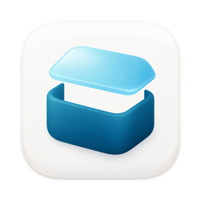
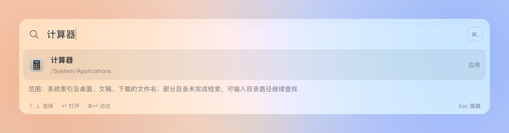
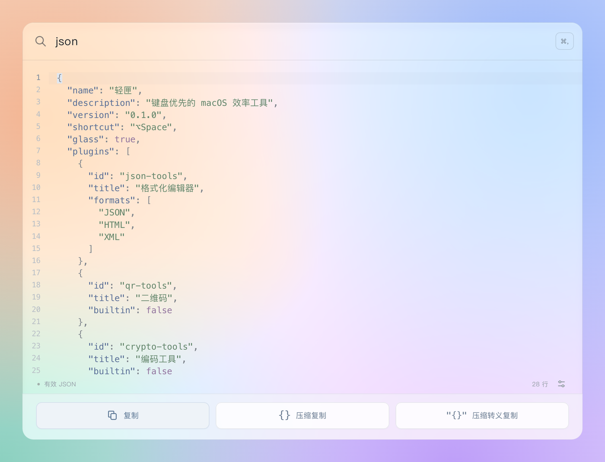
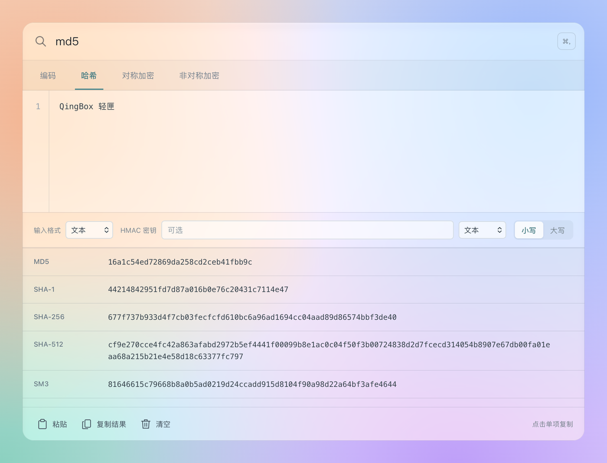
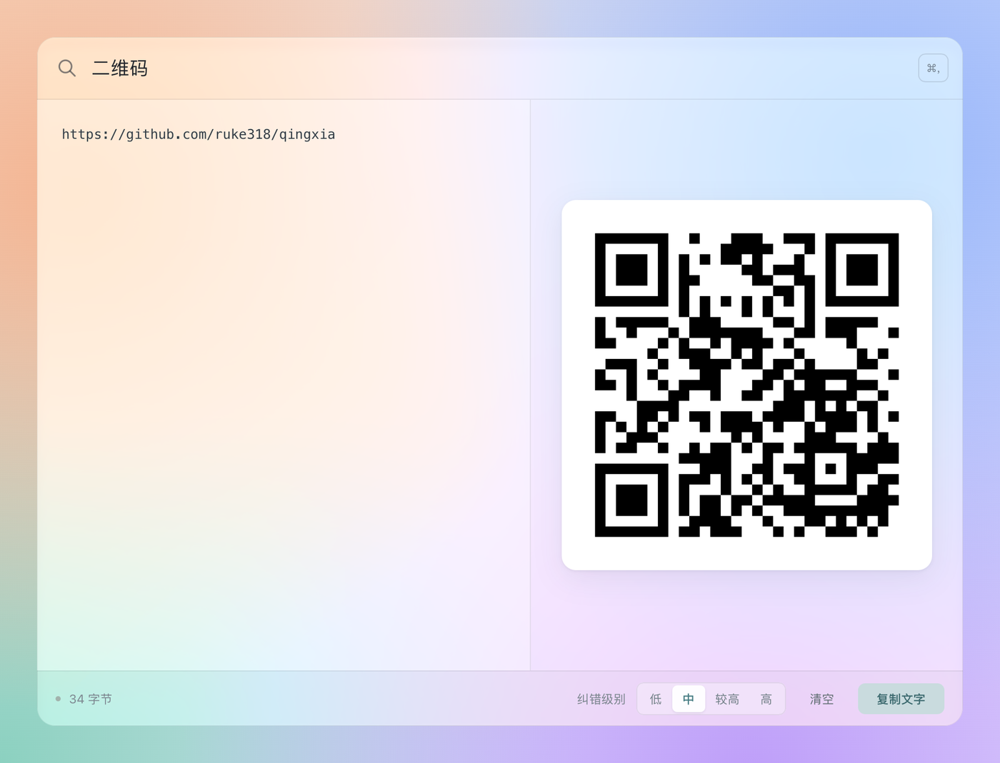

<div align="center">



# 轻匣 QingBox

[](#-快速开始)
[](https://tauri.app/)
[](https://react.dev/)
[](https://www.rust-lang.org/)
[](https://www.typescriptlang.org/)
[](LICENSE)

**键盘优先的 macOS 效率工具：一个快捷键，搜索一切，工具随手可用。**

[特性](#-特性) · [插件](#-插件) · [快速开始](#-快速开始) · [插件开发](#-插件开发) · [隐私与安全](#-隐私与安全)



</div>

## 📖 简介

轻匣是一个类似「聚焦搜索」的悬浮输入框：按下 `⌥Space` 唤起，输入关键词即可打开应用、文件和目录；JSON 格式化、编码加密、二维码、Hosts 切换、剪贴板历史等常用工具以插件形式提供，同样一搜即达。

所有数据只保存在本机，不需要账号，不依赖任何云服务。插件运行在沙箱中，只能使用自己在清单里声明的能力。

> 项目处于早期阶段，目前只支持 macOS。


https://github.com/user-attachments/assets/529072fc-3e34-4acc-8869-47c336f2e272


## ✨ 特性

- **⚡ 一键唤起** - 默认 `⌥Space` 唤起、`Esc` 收起，快捷键可自定义；每个插件也能单独绑定全局快捷键
- **🔍 应用、文件、目录一起搜** - 结合 Spotlight 索引与常用目录的实时检索，新文件也能搜到；应用优先并显示系统图标
- **📂 目录直达** - 输入路径直接列出目录内容，`Tab` 补全，`⌘↵` 在访达中显示
- **🪟 原生质感** - macOS 26 及以上使用与系统聚焦搜索相同的 Liquid Glass 材质，插件与主入口共用同一块玻璃
- **🧩 插件化** - 插件就是一个静态网页目录，提供 TypeScript SDK、消息协议文档和最小示例，本地导入即可使用
- **🔒 本地优先** - 无账号、无云端、不联网；插件在沙箱中运行，按权限访问宿主能力

## 🧩 插件

### 内置插件

随应用一起打包，开箱即用。

| 插件 | 打开方式 | 能做什么 |
| --- | --- | --- |
| **格式化编辑器** | 搜索 `json` `xml` `html` | 粘贴即格式化 JSON / HTML / XML；自动去除整段 JSON 的外层转义；语法有误时仍按括号排版并标出错误位置；底部常驻 JSONPath 查询栏（`⌘F` 聚焦）（过滤、递归、切片，大整数不丢精度）；一键复制、压缩复制、压缩转义复制 |
| **Hosts 切换** | 搜索 `host` | 按分组管理 hosts，多组同时启用，自动检测冲突；写入系统前自动备份 |
| **剪贴板历史** | `⌥⇧V` 或搜索 `剪贴板` | 记录文本、图片、文件，最多 200 条，只存本机；系统标记为隐私或临时的内容不记录 |

### 外部插件

不打进安装包，按需构建后在「设置 → 插件管理 → 本地导入」中导入。

| 插件 | 打开方式 | 能做什么 |
| --- | --- | --- |
| **[编码工具](plugins/crypto-tools)** | 搜索 `base64` `md5` `aes` `rsa` | **编码**：Base64、URL 安全 Base64、URL 编码、Unicode 转义、Hex<br>**哈希**：MD5、SHA-1/256/512、SM3，支持 HMAC<br>**对称加密**：AES、DES、3DES、SM4，CBC / ECB / GCM<br>**非对称**：RSA、SM2、ECDSA、Ed25519 的加解密、签名验签与密钥生成 |
| **[二维码](plugins/qr-tools)** | 搜索 `二维码` `qr` | 文字实时生成二维码；按 `⌘V` 粘贴截图即可识别其中的二维码 |
| **[时间戳](plugins/timestamp-tools)** | 搜索 `时间戳` `ts` `unix` | 秒 / 毫秒 / 微秒 / 纳秒时间戳与日期互转，自动识别单位和常见日期格式；空输入实时显示当前时间，`⌘1`～`⌘5` 一键复制 |

### 截图

<div align="center">

<p><sub>格式化编辑器：粘贴即格式化</sub></p>
</div>

<table>
<tr>
<td width="50%"></td>
<td width="50%"></td>
</tr>
<tr>
<td align="center"><sub>编码工具：一次算出全部哈希</sub></td>
<td align="center"><sub>二维码：生成与粘贴识别</sub></td>
</tr>
</table>

## 🚀 快速开始

### 环境要求

| 依赖 | 版本 |
| --- | --- |
| macOS | 13 或更高（Liquid Glass 需要 26 及以上） |
| Xcode Command Line Tools | `xcode-select --install` |
| [Node.js](https://nodejs.org/) | 20.19+ 或 22.12+ |
| [Rust](https://rustup.rs/) | 由 `rust-toolchain.toml` 固定，rustup 会自动安装 |

### 构建并运行

```sh
git clone https://github.com/ruke318/qingxia.git
cd qingxia
npm ci

# 开发模式：同时启动前端开发服务与原生应用
npm run tauri -- dev

# 构建应用包：src-tauri/target/release/bundle/macos/轻匣.app
npm run tauri -- build --bundles app
```

构建出的应用使用本地临时签名（ad-hoc），拷到 `/Applications` 即可使用。首次访问桌面、文稿、下载目录时，系统会请求授权。

### 构建外部插件

```sh
npm run build:crypto   # 产物：dist-plugins/crypto-tools
npm run build:qr       # 产物：dist-plugins/qr-tools
npm run build:timestamp  # 产物：dist-plugins/timestamp-tools
```

在轻匣中打开「设置 → 插件管理 → 本地导入」，选择对应的产物目录即可。

## 🛠 插件开发

插件就是一个静态网页目录，运行在只允许脚本的沙箱 iframe 中，通过消息协议调用宿主能力（存储、剪贴板、快捷键等）。最小的插件只需要三个文件：

```
my-plugin/
├── manifest.json   # 标识、名称、入口、命令、权限
├── index.html
└── main.js
```

```json
{
  "apiVersion": 1,
  "id": "my-plugin",
  "name": "示例插件",
  "version": "0.1.0",
  "entry": "index.html",
  "commands": [{ "id": "open", "title": "示例插件", "keywords": ["示例"] }],
  "permissions": []
}
```

| 资料 | 说明 |
| --- | --- |
| [`examples/minimal-plugin`](examples/minimal-plugin) | 不依赖任何构建工具的完整示例 |
| [`packages/plugin-sdk`](packages/plugin-sdk) | TypeScript SDK，所有内置与外部插件都基于它编写 |
| [接口约定](docs/接口约定.md) | 清单字段、沙箱限制、消息协议 v1、全部宿主能力与错误码 |

> 面板背景和配色由宿主统一管理：宿主会自动为插件注入主题样式表，插件页面保持透明，背景、边框等颜色只引用 `var(--qb-*)` 主题变量（见[接口约定](docs/接口约定.md)）。这样宿主调整外观时，插件无需修改。

## 🔐 隐私与安全

- 搜索、剪贴板历史、插件数据都只保存在本机的应用数据目录中，不上传任何内容。
- 插件运行在 `sandbox="allow-scripts"` 的 iframe 中，没有网络、Cookie、本地存储等浏览器能力，只能调用清单中声明了权限的宿主接口。
- **Hosts 免密**：Hosts 插件第一次写入时需要管理员授权，授权后会安装一个只能修改 hosts 的辅助程序和对应的 sudoers 规则，之后切换不再询问密码。不需要时可以移除：

  ```sh
  sudo rm /private/etc/sudoers.d/qingbox-hosts /Library/PrivilegedHelperTools/local.qingbox.hosts-helper
  ```

  hosts 备份位于 `/private/etc/.qingbox-hosts-backups/`，始终保留首次的原始备份和最近 5 次切换的备份。

## 🧪 测试

```sh
npm run test:json      # 格式化编辑器
npm run test:crypto    # 编码工具
npm run test:qr        # 二维码
npm run test:timestamp # 时间戳
npm run test:sdk       # 插件 SDK
npm run test:bridge    # 插件通信
npm run test:colors    # 检查插件样式没有写死颜色
npm run test:browser   # 颜色检查 + 各插件的浏览器回归测试（需要 Chrome，可用 CHROME_PATH 指定路径）
cd src-tauri && cargo test
```

## 📁 项目结构

```
qingxia/
├── src/                     # 主入口前端（React + TypeScript）
├── src-tauri/               # 原生部分（Rust + Tauri 2）
│   └── src/
│       ├── native_window.rs # 悬浮面板、玻璃材质、唤起与焦点
│       ├── search/          # 应用、文件、目录搜索
│       ├── plugins/         # 插件宿主：加载、沙箱协议、权限
│       ├── clipboard/       # 剪贴板历史采集
│       └── hosts.rs         # Hosts 写入与免密辅助程序
├── packages/plugin-sdk/     # 插件 SDK
├── plugins/                 # 插件源码
│   ├── json-tools/          # 格式化编辑器（内置）
│   ├── hosts-switch/        # Hosts 切换（内置）
│   ├── clipboard-history/   # 剪贴板历史（内置）
│   ├── crypto-tools/        # 编码工具（外部）
│   ├── qr-tools/            # 二维码（外部）
│   └── timestamp-tools/     # 时间戳（外部）
├── examples/minimal-plugin/ # 最小插件示例
├── tests/                   # 浏览器回归测试与模拟宿主
└── docs/                    # 设计文档与接口约定
```

## 📄 许可证

本项目基于 [MIT](LICENSE) 许可证开源。

---

<div align="center">

**如果轻匣对你有帮助，欢迎点一个 ⭐ Star！**

</div>
