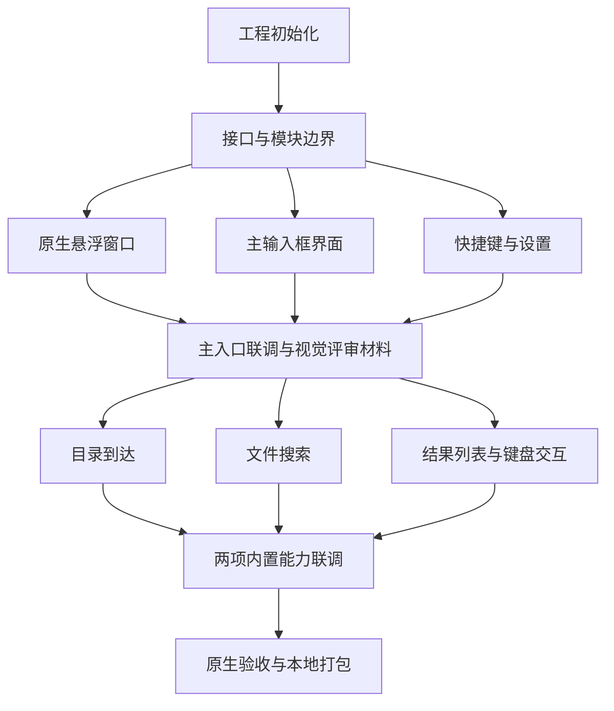

# 主入口任务拆分与状态跟踪

更新时间：2026-09-20。

当前阶段：第四轮处理中文与反复搜索失效、目录内容、应用搜索与真实图标、搜索延迟及唤起白闪。透明度与居中按用户要求暂缓调整；按最新要求统一上限 50 项，单次原生查询正在验收，不添加搜索结果缓存。

范围依据：[主入口实施计划](主入口实施计划.md)。本轮只交付主输入框、可配置唤起快捷键、内置目录到达和文件搜索，插件框架与插件界面不纳入本轮。

本文件是任务状态的唯一记录入口。主入口计划记录需求，本文件记录依赖、执行步骤、状态、验收证据和阻塞。集成负责人为主代理；native_window 代理已完成原生窗口方案的只读核对，当前代码与联调由主代理完成。

## 一、状态规则

| 状态 | 含义 |
| --- | --- |
| 已完成 | 本任务的交付与验收均已完成，并有可定位证据 |
| 待开始 | 前置条件满足，可以领取，但尚未执行 |
| 等待依赖 | 尚有未完成的前置任务，属于正常排队 |
| 进行中 | 已开始执行，记录实际负责人和正在处理的步骤 |
| 待验收 | 实现已提交，需要完成规定的验证 |
| 阻塞 | 出现超出正常依赖等待的问题，需记录原因、影响和解除条件 |

- 子步骤用复选框记录；只有该步骤完成并有证据后才勾选。
- 开始任务时更新状态、实际负责人及当前步骤；完成或受阻后及时更新。
- 进入“待验收”时填写验证方式；通过后将任务改为“已完成”，补充证据，并检查下游任务是否可以改为“待开始”。
- 构建通过、浏览器预览、原生桌面实测分别记录，不能相互替代。
- 未覆盖的场景标明“未验证”；不能把前置模块完成写成整体功能已完成。
- 避免在 README 重复维护各任务状态，README 仅链接本文件。

## 二、当前总览

当前推进插件阶段，最新状态见本文第十一节；以下为主入口原始任务表，后续修复与验收证据按各轮记录补充，不代表插件已经实现。

### 规划任务

| 编号 | 任务 | 状态 | 完成依据 |
| --- | --- | --- | --- |
| P01 | 创建项目并编写立项书 | 已完成 | 项目 README 与立项书已落盘 |
| P02 | 确认技术栈 | 已完成 | 用户确认 Tauri 2 + React + TypeScript + Rust + SQLite，已同步文档 |
| P03 | 确认主入口范围与样式参数 | 已完成 | 用户确认输入框方向、屏幕 1/3 宽、60px 高、上方 1/3、快捷键可配置；目录到达与搜索已调整为内置 |
| P04 | 拆分可并发任务并建立状态表 | 已完成 | 本文件包含任务依赖、文件边界、子步骤与验收标准 |

### 开发任务

| 编号 | 任务 | 前置依赖 | 执行组 | 负责人角色 | 当前状态 | 验收证据 |
| --- | --- | --- | --- | --- | --- | --- |
| T01 | 初始化工程与构建基线 | 无 | 准备阶段 | 主代理 | 已完成 | 依赖与锁文件已生成；前端构建、Rust 检查及原生启动通过，见本轮验证记录 |
| T02 | 确定命令接口与模块边界 | T01 | 准备阶段 | 集成负责人 | 已完成 | 两端类型与 bridge 已建立，接口约定已同步当前实现 |
| T03 | 原生悬浮窗口与桌面行为 | T02 | 并发组 A | 主代理 / native_window 复核 | 待验收 | 已改为非激活 NSPanel、原生圆角裁切与无外阴影；打包启动通过，全屏/多屏实测未完成 |
| T04 | 主输入框界面 | T02 | 并发组 A | results_ui / 主代理 | 待验收 | 完整原生毛玻璃强度 + 36% 白色遮罩；移除强白边和外阴影；原生截图工具超时 |
| T05 | 可配置快捷键与 SQLite 设置 | T02 | 并发组 A | 设置负责人 | 进行中 | SQLite、快捷键录入/替换与菜单栏入口已实现；冲突与重启场景待实测 |
| T06 | 主输入框与快捷键联调 | T03、T04、T05 | 第一轮集成 | 集成负责人 | 进行中 | 已生成并启动 .app，本地页面被系统识别；交互验收待完成 |
| T07 | 内置目录到达 | T06 | 并发组 B | search_fix / 主代理 | 待验收 | 自身置顶、目录与文件同列、应用包区分、排序与截断已实现，5 项目录测试通过 |
| T08 | 内置文件与应用搜索 | T06 | 并发组 B | search_fix / 主代理 | 进行中 | 中文显示名、应用优先已实机返回；正在验证会话保序、50 项上限和单次原生查询 |
| T09 | 结果列表与键盘交互 | T06 | 并发组 B | results_ui / 主代理 | 待验收 | 中文组合输入、会话复用、应用与目录打开、真实图标懒加载已接入；原生操作待验收 |
| T10 | 两项内置能力与主入口联调 | T07、T08、T09 | 第二轮集成 | 主代理 | 进行中 | 正在验证新搜索、列表高度与原生唤起 |
| T11 | 原生验收与本地打包 | T10 | 交付阶段 | 主代理 | 进行中 | 本地调试包已反复构建验证，仍有多屏、全屏、真实输入法与白闪场景待验收 |

2026-09-21：内置搜索修复已完成构建、安装及真实索引测试，用户反馈目前使用基本正常，允许推进插件阶段。原生窗口的全屏、多屏等专项验收仍按此前记录保留。

## 三、并发执行顺序

- 准备阶段按 T01 → T02 串行完成。
- 并发组 A 同时执行 T03、T04、T05，分别负责窗口、界面和设置。
- T06 完成真实输入框与快捷键闭环，产出可查看的原生窗口；目录和搜索开发不影响这份成果交付。
- 并发组 B 同时执行 T07、T08、T09，目录与搜索后端各自实现，前端先用固定样例验证交互。
- T10 接入真实后端，移除开发样例；T11 统一验收与打包。
- 每轮最多安排三个并发开发任务，集成负责人负责共享文件与联调。

## 四、并发修改边界

以下保留后续并发拆分边界。当前初版集中在 `src/App.tsx` 和 `src-tauri/src/lib.rs`，由主代理统一修改；两端类型及 bridge 已创建，其余模块目录尚未拆出。

| 负责范围 | 拟定路径 | 修改约束 |
| --- | --- | --- |
| 工程配置与公共入口 | 根级工程配置、锁文件、`src/App.tsx`、`src/main.tsx`、`src-tauri/src/lib.rs`、Tauri 配置与权限文件 | 由集成负责人统一修改 |
| 公共接口 | `src/lib/bridge.ts`、`src/lib/types.ts`、`src-tauri/src/contracts.rs` | T02 建立；后续接口变更由集成负责人同步两端 |
| 原生窗口 | `src-tauri/src/window/`、`src-tauri/src/platform/macos/window.rs` | T03 独占；提供宿主显示、隐藏与调整尺寸能力 |
| 输入框与结果界面 | `src/features/launcher/` | T04 与 T09 分属前后两轮，不同时修改 |
| 快捷键与设置 | `src/features/settings/`、`src-tauri/src/settings/`、`src-tauri/src/shortcuts/` | T05 独占；通过窗口接口唤起，不修改窗口内部实现 |
| 目录到达与文件打开 | `src-tauri/src/files/` | T07 独占，提供目录补全、打开文件／目录和访达定位操作 |
| 文件搜索 | `src-tauri/src/search/`、`src-tauri/src/platform/macos/search.rs` | T08 独占，返回查询结果，不重复实现文件打开 |

新增依赖、命令注册、模块导出、权限或根级配置调整，由对应任务列出具体需求，集成负责人串行接入。各任务不改写其他任务的工作文件。

任务负责人提供聚焦于本模块的验证结果，集成负责人检查实际代码和联调证据后更新状态。公共接口有变化时，先通知受影响任务再继续集成。

## 五、逐任务步骤与验收

### T01：初始化工程与构建基线

状态：已完成。依赖：无。

- [x] 核对本机开发工具与系统版本，记录原生构建所需环境。
- [x] 初始化 Tauri 2、React、TypeScript、Rust 工程，确定目录与依赖锁文件。
- [x] 确认 SQLite 接入方案和应用数据目录，按当前需求引入依赖。
- [x] 完成前端构建、Rust 检查和最小原生应用启动，记录实际命令与结果。

验收：工程能从项目目录构建并启动；已有文档和设计资产保留。具体工具版本与失败项有记录。

### T02：确定命令接口与模块边界

状态：已完成。依赖：T01。

- [x] 确定主入口显示／隐藏、窗口尺寸和设置读写的调用约定。
- [x] 确定目录补全、文件搜索、打开文件和访达定位的请求／响应字段。
- [x] 约定查询标识、结果类型、数量限制、错误返回和过期结果处理。
- [x] 在两端建立必要类型并同步目录所有权，记录供并发任务使用的接口说明。

验收：各任务可以按同一接口独立开发；首期接口不包含插件运行时或通用脚本执行能力，不引入当前未使用的抽象。

### T03：原生悬浮窗口与桌面行为

状态：待验收。依赖：T02。与 T04、T05 并发。

- [x] 实现无标题栏、无红黄绿按钮的原生透明窗口及实际桌面背景模糊。
- [x] 实现当前屏幕宽度 1/3、输入框高 60 逻辑像素、水平居中及中心位于可用高度 1/3 的定位。
- [x] 实现显示、聚焦、隐藏与向下展开，保持输入框顶部不变。
- [x] 实现按住输入框空白区域拖动窗口，且不影响输入、按钮和结果行交互。
- [ ] 验证多屏坐标、Retina 缩放、全屏应用、拖动以及重复唤起不生成多窗口。

验收：真实桌面上的背景模糊和位置可检查，文字保持清晰。窗口本身可从菜单栏唤起，未完成全局快捷键集成不算该能力整体可用。

### T04：主输入框界面

状态：待验收。依赖：T02。与 T03、T05 并发。

- [x] 实现透明页面、60px 输入行、18px 初始圆角、细边线及浅色背景遮罩。
- [x] 实现搜索图标、占位文字、聚焦态与输入状态，不增加传统应用顶栏。
- [x] 实现空输入仅显示输入框的行为，通过窗口接口对接聚焦和隐藏。
- [ ] 用浏览器或前端运行环境检查布局与输入法组合输入，不将该结果视为原生毛玻璃验收。

验收：界面遵循主入口规格，原生毛玻璃保持完整强度，白色遮罩不透明度为 36%，文字与图标不跟随整体变透明。

### T05：可配置快捷键与 SQLite 设置

状态：进行中。依赖：T02。与 T03、T04 并发。

- [x] 实现 SQLite 设置读写、首次默认值及重启恢复。
- [x] 实现快捷键录入界面，以 `⌥Space` 为建议初始值。
- [ ] 实现系统注册、冲突提示、替换及失败回退；保存失败时恢复一致状态。
- [ ] 保留菜单栏进入设置的路径，验证快捷键不可用时仍能操作。

验收：修改后即时生效，重启后保留；修改失败时旧绑定仍可用；首次注册失败有提示和可操作入口。

### T06：主输入框与快捷键联调

状态：进行中。依赖：T03、T04、T05。

- [x] 统一接入窗口、前端、设置、菜单栏和全局快捷键。
- [ ] 验证从其他应用唤起后立即输入、Esc 隐藏、再次唤起与配置保存。
- [ ] 在真实桌面背景下检查宽高、位置、透明度和焦点行为，修复集成问题。
- [ ] 保存原生界面截图及验证记录，交付第一份可运行主入口供视觉评审。

验收：真实毛玻璃输入框和可配置快捷键形成闭环。此任务完成不代表用户已认可所有视觉细节，收到反馈后另行记录调整。

### T07：内置目录到达

状态：待验收。依赖：T06。与 T08、T09 并发。

- [x] 识别 `/` 和 `~/` 路径，完整目录自身置顶，同时列出目录和文件。
- [x] 返回目录名称与完整路径，提供继续补全及在访达中打开能力。
- [x] 提供文件打开与访达定位操作，供搜索结果复用。
- [ ] 用临时目录验证中文、空格、同名项、不存在路径和错误返回。

验收：目录补全和打开操作独立可用，不依赖插件；普通目录名称检索由 T08 提供，整体流程在 T10 验证。

### T08：内置文件搜索

状态：进行中。依赖：T06。与 T07、T09 并发。

- [x] 接入 macOS Spotlight 元数据查询，检索文件和目录。
- [x] 实现异步查询、结果数量限制，以及取消或忽略过期结果。
- [x] 返回统一结果字段，区分空结果、查询失败和已知范围限制。
- [ ] 记录真实测试目录、索引状态、查询样例和耗时。

验收：连续输入不会收到覆盖新查询的旧结果；索引依赖和未覆盖位置明确记录；不以单次快速返回代替性能验收。

### T09：结果列表与键盘交互

状态：待验收。依赖：T06。与 T07、T08 并发。

- [ ] 基于固定开发样例实现结果列表、名称与路径展示、空状态和错误提示。
- [ ] 实现上下选择、继续补全、回车打开、访达定位和 Esc 行为。
- [ ] 实现向下展开、可用高度限制和列表滚动，保持输入行位置与高度不变。
- [ ] 验证中文输入法选字时回车不执行打开，组合输入期间不错误处理导航键。

验收：样例状态下交互完整；记录当前使用样例数据，真实目录和搜索接入由 T10 完成。

### T10：两项内置能力与主入口联调

状态：进行中。依赖：T07、T08、T09。

- [ ] 接通路径输入与普通关键词的路由，分别调用目录到达或文件搜索。
- [ ] 接通结果选择、打开及访达定位，移除正式运行路径上的开发样例。
- [ ] 验证普通目录名搜索后打开，以及同名文件／目录的路径区分。
- [ ] 验证查询竞态、错误展示、展开收起及快捷键在完整流程中保持可用。

验收：两个内置能力通过真实数据在同一个主入口中工作，不依赖插件初始化。

### T11：原生验收与本地打包

状态：进行中。依赖：T10。

- [ ] 完成类型检查、前端构建、Rust 检查及必要的功能验证，记录命令与结果。
- [ ] 在可用设备上检查多屏、Retina、全屏、中文输入法、重启、快捷键冲突与修改失败场景。
- [ ] 按立项书口径测量热唤起、查询耗时和整个应用进程树的资源占用。
- [ ] 生成本地应用包，验证打包版本，记录产物路径、已知限制和未验证场景。

验收：提供可以本机运行的主入口，以及可复核的验证记录。缺少所需设备或环境时保留“待验收”或明确记录阻塞，不能直接标记全场景通过；本轮不包含公开发布。

## 六、状态变更记录

| 日期 | 任务 | 状态变化 | 说明 |
| --- | --- | --- | --- |
| 2026-09-20 | P01～P03 | 已完成 | 汇总本次任务拆分前已完成的项目文档和用户确认事项 |
| 2026-09-20 | P04 | 已完成 | 建立任务拆分、两轮并发关系、文件修改边界和逐步骤状态 |
| 2026-09-20 | T01 | 待开始 | 当前唯一无开发前置依赖的任务 |
| 2026-09-20 | T02～T11 | 等待依赖 | 尚未启动，按依赖图推进 |

后续每次状态变化追加一行，并同步总览、对应任务步骤和验收证据。

| 2026-09-20 | T01 | 进行中 | 用户要求开始开发，完成环境盘点，开始初始化工程；补充输入框可拖动要求 |

| 2026-09-20 | T01、T02 | 已完成 | 工程、锁文件、SQLite 与接口约定落地；前端和 Rust 构建通过，已启动打包应用并识别到本地页面 |
| 2026-09-20 | T03～T06 | 进行中 | 主入口、快捷键与菜单栏已集成；修复拖动权限及展开重置位置，完成 .app 打包，原生交互验收仍待完成 |
| 2026-09-20 | T04 | 视觉调整 | 用户反馈背景过黑；将 hudWindow 深色材质与 30% 黑色遮罩改为浅色 popover 材质、14% 白色遮罩和深灰文字 |

## 七、本轮验证记录

- `npm run build`：通过 TypeScript 检查与 Vite 构建。
- `cargo check --manifest-path src-tauri/Cargo.toml`：初始化阶段通过；后续变更由完整原生打包编译覆盖。
- `cargo fmt --manifest-path src-tauri/Cargo.toml`：已执行。
- `npm run tauri -- build --debug --bundles app`：通过；浅色版本已重新打包。
- 本地产物：`src-tauri/target/debug/bundle/macos/轻匣.app`。已停止旧版进程，并通过桌面工具启动浅色版本；系统识别到标题“轻匣”、地址 `tauri://localhost`、搜索输入框及设置按钮。
- 实际桌面截图与快捷键自动化调用多次返回 `timeoutReached`；未将这些调用记为通过。进程只读采样显示主线程在正常事件循环等待，未见本次采样中的主线程死锁。
- 拖动实现证据：权限文件包含 `core:window:allow-start-dragging`；左键在搜索图标及输入行空白区域调用原生拖动，输入与按钮排除；展开仅调整尺寸，不重新定位。鼠标拖动实测仍待完成。
- 宽度已按显示器物理宽度除以缩放比例后再取 1/3；高度为 60 逻辑像素。多屏切换、真实桌面尺寸测量、输入法、快捷键冲突与持久化重启场景未验收。
- 首次运行可见入口，后续通过快捷键或菜单栏唤起；快捷键更换、失败恢复已实现，仍待系统场景验证。
- Spotlight、目录继续补全、访达定位交互、性能指标和完整端到端验收未完成；当前应用包是可运行原型。

## 八、用户实测反馈修复（第二轮）

| 编号 | 用户反馈 | 实现与状态 | 验证 |
| --- | --- | --- | --- |
| R01 | 毛玻璃不通透 | 原生背景材质单独设为 52% 不透明度；网页白色遮罩降至 8%，移除重复网页模糊；文字不降低透明度 | 原生窗口截图已取得；实际桌面背景透视观感仍需用户复核 |
| R02 | 底部提示需滚动 | 60px 输入区与 32px 底栏固定；只有列表滚动；提示单独计入尺寸 | 原生搜索 json 返回 200 项，连续向下选中第 11 项时列表滚动，底栏始终可见 |
| R03 | 扩展屏唤起到了主屏 | AppKit 按鼠标所在 NSScreen 定位，统一使用逻辑点坐标 | 负坐标屏、上方屏、1/3 宽几何测试通过；实机多屏待复核 |
| R04 | 文件夹与文件类型图标 | 新增文件夹及 PDF、JSON、代码、文档、表格、幻灯片、图片、音视频、压缩包、应用等 SVG 与类型标签 | 图标映射抽查通过，原生界面已检查文件夹和 JSON 图标 |
| R05 | 搜索结果不全 | 移除 4 个目录/4 层限制，查询全部系统索引；最多 200 项并明确截断，后台执行并隔离过期结果 | 搜索测试通过；同一 qingbox 查询终端 666 项、应用 3 项，差异集中在文稿目录。已补首次目录访问申请与失败提示，授权后覆盖率待复核，不能标记搜全 |
| R06 | 从其他应用唤起未置前 | 在主线程激活应用、设置浮动层级、取得键盘焦点并置前，补全全屏辅助空间行为 | 构建已通过；启动与原生输入通过，跨应用快捷键自动化超时，全屏与实际置前仍待复核 |

本轮并发分工：`search_fix` 负责 `src-tauri/src/search.rs`，`results_ui` 负责前端列表与图标，主代理负责原生窗口、命令接入、复核、验证和打包。

本轮已通过 5 项 Rust 测试（3 项窗口坐标/展开、2 项搜索特殊路径/截断/过期结果）；文件类型映射检查通过。屏幕坐标测试不能替代多屏实际唤起验收。

### 第二轮原生验证补充

- 本地调试应用包编译通过，并重启进入新版；原生输入、目录类型图标、JSON 类型图标已核对。
- 搜索 `json` 返回 200 项且显示截断提示；连续按 10 次向下键，选中结果滚入视口，32px 底栏保持可见，无需滚到列表末尾。
- 同一名称表达式查询 `qingbox`：终端 Spotlight 返回 666 项，全部可读取元数据；663 项位于文稿项目下、3 项位于 Library。应用初次实测仅返回 Library 的 3 项。优先怀疑文稿访问授权差异，系统授权日志不可读，未把该原因写成已证实。
- 已在后台首次搜索中检查桌面、文稿和下载目录的访问能力，触发所需系统授权；未获准时显示具体目录和处理路径。系统授权由用户操作，未代替用户批准。目录查询也改为后台任务，权限等待不会堵住主线程。
- 新增中文系统权限用途说明 `src-tauri/Info.plist`，便于用户判断为何需要目录访问。修改系统权限后需重启轻匣，刷新本次进程的访问检查结果。
- 跨应用快捷键与后续桌面自动化仍有 `timeoutReached` / `noWindowsAvailable`，不能据此宣布多屏或跨应用置前通过；未改动其他应用文件。
- 原生背景采用 [Apple 文档中的窗口后方混合](https://developer.apple.com/documentation/appkit/nsvisualeffectview/blendingmode-swift.enum/behindwindow)，单独降低背景视图的不透明度，未降低窗口整体或文字的不透明度。

- 最终版本再次通过前端构建、原生编译与 .app 打包；3 项中文目录权限用途说明已核对打入应用包。旧进程已停止，新包已重新打开并识别到主入口输入框。首次目录授权的接受/拒绝由用户决定，本轮未代批。

## 九、用户实测反馈修复（第三轮）

以下记录取代第二轮的当前实现参数；第二轮保留为历史验证记录。

| 编号 | 用户反馈 | 修改与步骤状态 | 验证与限制 |
| --- | --- | --- | --- |
| R07 | 底部黑白细条 | 已移除原生矩形阴影、网页外阴影与强白边；原生内容层按 18px 圆角裁切 | 新版原生截图中底部已无矩形条，复杂桌面背景下仍需复核 |
| R08 | 多次搜索后无结果 | 已移除搜索入口的同步权限检查与逐项磁盘元数据读取，改为异步子进程；4 秒总期限，取消后回收；前端同步提交唤起清空，避免马上输入同词被吞掉 | 6 项后端进程测试通过；真实 React 组件模拟 IPC 覆盖 19 次请求，其中连续唤起 12 轮通过；新版原生搜索返回 200 项 |
| R09 | 太透明且看不到毛玻璃 | 用户再次反馈后，取消材质层透明度衰减，原生背景模糊保持完整强度，网页白色遮罩由 8% 提高至 36% | 最终浅色版本已打包并启动，原生截图已取得；窗口截图不包含完整背景，尚不能据此确认实际桌面模糊观感 |
| R10 | 全屏应用唤起切回桌面 | 已转换为可接收键盘但不激活应用的 NSPanel，移除应用激活调用；保留原 Tauri delegate 与失焦隐藏；固定原生面板依赖版本 | 编译启动通过；独立源码复核未发现阻断问题。全屏快捷键后的窗口读取超时，不能标记全屏实测通过 |
| R11 | 左右未居中 | 已在 AppKit 完成显示后，以窗口实际宽度再次对齐所选屏幕中心，并记录左右留白；垂直位置维持原约定 | 增加实际宽度受约束后的左右等距测试；真实窗口留白正在核对 |

### 并发分工与验证步骤

- [x] `results_ui`：前端查询竞态、跨视图请求身份与边线；修改仅限前端文件及浏览器回归页。
- [x] `search_fix`：搜索超时、取消、回收及聚焦测试；修改仅限 `search.rs`。
- [x] 主代理：原生面板、配置、集成复核、测试与打包；`native_window` 独立只读复核面板、delegate、最低系统版本与输入法层级兼容。
- [x] 搜索聚焦测试覆盖无输出超时、连续 3 次超时后恢复、新查询取消旧查询、旧编号晚发布、输出结束但进程未退出、达到容量后回收。通过进程编号检查确保已回收。
- [x] 浏览器回归页 `tests/launcher-query.browser.html` 导入实际 React 入口并模拟 Tauri IPC，覆盖乱序回包、清空、设置往返、连续唤起与同词紧邻输入；19 次请求全部通过，控制台无错误或警告。
- [x] 前端构建、原生编译和调试应用包构建通过；新的包已启动，原生面板与搜索输入框可被系统识别。
- [x] 原生截图已取得：浅色面板、文件夹图标、200 项截断提示、固定底栏；底部没有之前的黑白矩形条。
- [ ] 全屏 Space 中实际唤起、输入、Esc 返回原应用、多屏位置与中文候选框实测。原生桌面自动化读取多次超时；Chrome 专用浏览器连接缺少认证；读取 Chrome 窗口内容被自动审批拒绝，因为可能包含无关管理后台信息，已停止该路径。
- [ ] 用户复核最终背景模糊强度与左右居中观感。

复测浏览器页：运行 `npm run dev -- --port 1421`，打开 `http://127.0.0.1:1421/tests/launcher-query.browser.html`；开发者工具中等待 `window.__launcherRegression`，应返回 `passed: true`。该页只在开发服务下使用，不进入正式入口。

本轮未改变用户的系统隐私授权，也没有重建整个系统索引。全屏和索引覆盖未验证部分继续保留“待验收”。

## 九、第四轮反馈与 50 项限制

以下为当前实现；前文 200 项及子进程方案保留为历史验收记录。

| 步骤 | 修改与验收目标 | 状态 |
| --- | --- | --- |
| R12 | 中文组合输入期间不搜索、不调整窗口；提交后查询最终中文 | 浏览器模拟两种输入事件顺序通过，真实输入法候选框待验收 |
| R13 | 目录自身置顶，同时列出目录与文件，最多 50 项 | 已完成，5 项目录测试通过 |
| R14 | 真实应用图标独立懒加载，名称采用系统本地化显示名 | 前端回归与原生图标编译通过，应用内截图待验收 |
| R15 | 以会话与请求编号保序，迟到旧请求不能取消新请求 | 已实现，最终测试进行中 |
| R16 | 单次原生索引查询，收到足够候选后停止，最多显示 50 项 | 已实现，最终 Rust 真实索引测试进行中 |
| R17 | 窗口背景和材质仅在隐藏初始化时配置，唤起前不强制绘制 | 已实现，反复唤起白闪实测待验收 |
| R18 | 统一构建、启动新应用包并核对功能 | 进行中 |

### 本轮并发与证据

- [x] `results_ui`：会话初始化、两处查询限额 50、中文输入和图标回归；正常及首次会话失败重试两个场景，各 31 次查询、15 项检查通过，控制台无异常。
- [x] 主代理：目录提前停止枚举，目录自身计入 50 项；无需统计全部匹配数量，提示输入更精确路径；5 项目录测试通过。
- [x] `native_window` 与主代理：原生 `MDQuery` 对照实测，发现 `MDQuerySetMaxCount(51)` 会漏掉微信输入法；移除该接口，按异步批次计数提前停止即可恢复完整 10 项。路径单独读取，避免批量属性接口返回 Data 卷别名。
- [x] `search_fix`：替换三次 `mdfind` 为单次 `MDQuery`；对象只在同一工作线程创建、查询、停止和释放；许可随工作线程持有，外层等待被取消也不能启动重叠查询。
- [ ] 最终 Rust 默认测试和本机真实索引重复查询、取消恢复、50 项上限测试。
- [ ] 最终应用包构建与原生操作复核。

本轮不添加搜索结果缓存。前端复用会话初始化 Promise 和应用图标资源，不复用搜索结果。透明度、左右居中按用户要求暂停调整；多屏、全屏与白闪仍按实际原生验证结果记录。

## 十、第五轮：安装版中文漏项与应用置顶（2026-09-21）

之前的命令行测试通过不能代表安装版行为。本轮以 `/Applications/轻匣.app` 的实际进程记录为依据。

| 步骤 | 证据或修改 | 状态 |
| --- | --- | --- |
| R19 | 安装版收到正确“恩泽”，原生索引原始计数连续为 0，排除中文传参和结果转换丢失 | 已定位 |
| R20 | 系统文件与文件夹中桌面、文稿、下载均开启；同一进程先查 0 项，后台打开三目录均成功，再查 2 项 | 因果对照通过 |
| R21 | 搜索前在后台打开三个常用目录，不枚举内容、不缓存授权状态；移除无效的空结果重试 | 已实现；同进程对照与最终 23 项测试通过 |
| R22 | 应用和非应用分别取候选，精确应用名称优先，合计最多 50 项 | 排序回归通过；诊断包连续两次 Cursor 第一，均 50 项 |
| R23 | 修正打包签名，完整资源校验通过；签名修复本身未使“恩泽”恢复 | 已完成；不将签名误记为根因 |
| R24 | 最终构建、安装、反复搜索和重启验收 | 正式版构建和安装完成；安装进程因果/交替查询通过，最终界面读取超时，界面验收待确认 |

- 同进程因果证据：`qingbox-search-14099.jsonl`。访问前 0 项；三目录只打开、不遍历后 2 项；同进程子 `mdfind` 同样 2 项。换查 Cursor、微信后再查恩泽，仍为 2 项。
- 另一进程仅访问台州恩泽目录后能搜到该目录，但下载中的同名 JSON 尚不返回，进一步说明需要建立对应目录的当前进程访问资格。
- R21 在后台执行；外层取消或超时后不等待权限调用返回，后台线程完成前继续持有活动许可，避免重叠的原生查询。
- 本轮未调整系统隐私开关、未授予全盘访问、未重建系统索引、未增加搜索结果缓存。
- 原生自动化读取非激活面板仍偶发超时，后端进程记录与界面截图验收分开记录，不将前者冒充后者。

### 最终代码验证

- 全部 23 项 Rust 测试通过（含 4 项真实 Spotlight 测试，没有跳过）：连续 25 轮微信查询、恩泽目录与 JSON、中文计算器、Cursor 第一名、取消及超时恢复、50 项上限。
- 三个目录之间也检查取消和期限，过期任务不再继续打开后续目录；已经进行中的单次系统权限调用不能强行中断，外层可以及时返回。
- 前端构建通过。临时固定关键词启动探针已从产品代码移除；正式构建不编译调试查询日志。

- 最终正式版已安装到 `/Applications/轻匣.app`；完整签名验证通过，安装二进制与构建输出一致。SHA-256：`970b3fd1d2d7b3a992598d66c71638d2b03483808a0a94cb9fe8f0f9f4692a17`。
- 正式包确认不含临时查询日志探针。启动后原生窗口自动化读取仍返回超时；不能据此声明最终 UI 搜索截图已经验收。

## 十一、插件阶段（2026-09-21）

用户反馈：“好像没啥问题了”，并要求开始考虑插件设计及开发。将当前搜索问题记录为用户反馈基本正常；这不等同于自动化已覆盖全部窗口场景。

本轮已完成现有代码检查、Tauri 调用边界核对、[插件架构与开发计划](插件架构与开发计划.md)及任务拆分。第一批拟交付“插件框架 + JSON 插件”，剪贴板和 Hosts 后续分批实现。现已实现首版插件框架、管理界面和 JSON 插件；具体完成度及原生验证边界以本节末尾记录为准。

| 编号 | 任务 | 前置依赖 | 执行组 | 状态 | 验收记录 |
| --- | --- | --- | --- | --- | --- |
| PL00 | 插件方案与任务拆分 | 当前内置能力 | 设计 | 已完成 | 已核对当前窗口、命令、数据库和前端入口；设计文档及协议示例已写入 |
| PL01 | 描述协议校验、命令类型与 SDK 类型 | PL00 | 准备 | 已完成 | 需覆盖错误版本、重复命令、入口越界和有效包 |
| PL02 | 本地资源协议、独立视图与调用隔离 | PL01 | 并发 A | 待验收 | 需实际安装包验证 IPC、CSP、实例身份与失效调用 |
| PL03 | 插件发现、启停与隔离存储 | PL01 | 并发 A | 待验收 | 需验证损坏插件隔离、重启持久化、禁用不删数据 |
| PL04 | 插件快捷键与命令调度 | PL01 | 并发 A | 待验收 | 需验证内部和系统冲突、保存失败回滚、禁用解除 |
| PL05 | 搜索入口、插件管理与面板联调 | PL02、PL03、PL04 | 并发 B | 待验收 | 需验证返回、隐藏、重开、异步结果选择稳定与总数 50 |
| PL06 | JSON 插件 | PL02、PL03，PL04 联调 | 并发 B | 待验收 | 需验证精度、错误定位、复制、草稿、独立更新 |
| PL07 | 安装版整体回归与交付 | PL05、PL06 | 集成 | 待验收 | 需实际 .app 验证插件及原有文件/应用搜索 |
| PL08 | 剪贴板历史插件 | PL07 | 后续 | 已实现并安装，原生呼出待验收 | 详见 CB01—CB05，支持文本、图片、文件和全局快捷键 |
| PL09 | Hosts 插件 | PL07 | 后续 | 已实现并安装，原生授权待验收 | 详见下方 HS01—HS05；浏览器与临时文件回归通过 |

共享入口、Tauri 权限文件和原生窗口由集成负责人修改，避免并行任务覆盖文件。开发过程逐项更新状态；视觉预览、模拟接口测试、真实安装包验收继续分别记录。

### JSON 插件实施中（2026-09-21）

- 用户指定：主体为大编辑器，粘贴自动格式化并自动去转义；底部固定复制、压缩复制、压缩转义复制。
- 用户补充：主入口右侧原有设置按钮在同一面板下展开设置，包含插件管理和快捷键设置，保持简单。
- PL01 描述协议与 SDK 最小接口已实现；描述/路径校验 10 项测试通过。
- PL02 同窗口子 WebView、资源与调用权限已接入，原生编译通过，安装版验证进行中。
- PL03 插件导入与启用状态、PL04 快捷键、PL05 同面板设置接入进行中。
- PL06 JSON 编辑器已实现行号/高亮/粘贴格式化/三种复制，8 项无损算法测试通过，实际剪贴板验收进行中。

### 固定内容区与设置整合（2026-09-21）

| 步骤 | 状态 | 验证记录 |
| --- | --- | --- |
| 顶部保留 60px，下方插件和设置固定 610px | 已完成 | 原生截图为 685×670；输入框 60、下方 610，设置及 JSON 均使用同一窗口 |
| 主入口右侧按钮展开设置，包含快捷键和插件管理 | 已完成 | 安装版实际点击打开设置并列出自带 JSON，停用/启用状态及打开按钮联动通过 |
| JSON 编辑器与三个固定底部复制按钮 | 已实现，待原生验收 | 8 项算法测试通过；浏览器实际粘贴自动格式化、大整数与压缩转义再次粘贴还原通过 |
| 本地插件目录导入、启停、重新加载 | 待验收 | 实际选择临时插件目录并成功复制到应用数据目录；启停通过。导入返回窗口与重载完整交互仍待复验 |
| 完整构建、安装和原生验收 | 待验收 | 最终构建、安装与签名通过；Mac 锁屏阻止最后一轮原生复验 |

### 本轮交付与验证边界

- 前端类型检查及宿主/插件构建通过；JSON 算法 8 项测试通过；Rust 38 项测试通过，4 项真实 Spotlight 专项测试本轮未运行。
- 安装版实际验证：主输入框下展开设置、插件列表、自带 JSON 打开、685×670 窗口截图、格式化保留中文与大整数、格式化复制成功反馈、压缩转义复制再粘贴自动还原、插件停用与重新启用。
- 本地导入实际使用系统目录选择器，临时 layout-check 插件已成功安装，随后移出并归档；只清理了本轮精确匹配的示例草稿。
- 已修复退出后迟到 ready 再次打开、资源路径中文与特殊字符编码、快捷键冲突时误解除宿主绑定、复制后 Esc 未响应、系统导入选择器被主面板遮挡、迟到失焦通知隐藏已重新置前面板。
- 最终包安装位置：`/Applications/轻匣.app`。安装二进制与构建一致，完整签名校验通过。SHA-256：`becf0134930be814c94f43f487cc7e26a270cd2b9f879e837594e605589beded`。
- 最后启动复验时，自动化明确报告 Mac 已锁屏且无法自动解锁。因此不将最终 Esc/导入返回、插件快捷键冲突/重启、长文档滚动、第三方插件调用隔离和全屏首次创建插件等专项标记为已验收。Wry 首次创建子 WebView 会激活应用，全屏场景需解锁后实际验证。
- 用户解锁后从应用程序打开轻匣，默认 `⌥Space` 唤起；右侧设置包含插件管理，搜索 `json` 或插件管理的“打开”可进入自带 JSON。

### JSON 去除重复标题栏（2026-09-21）

| 步骤 | 状态 | 验证记录 |
| --- | --- | --- |
| 移除 JSON 顶部标题栏 | 已完成 | 删除返回、标记、标题与说明所在的整行，编辑区直接衔接宿主输入框；内容区仍为 610px |
| 保留插件快捷键入口 | 已完成 | 原快捷键按钮移到现有底部状态栏，设置浮层随入口移至底部；Esc 仍可返回搜索 |
| 构建与安装 | 已完成 | TypeScript、前端与原生构建通过；已更新 /Applications/轻匣.app，完整签名校验通过；安装的插件脚本确认无 plugin-header |
| 原生视觉复验 | 待验收 | 启动工具报告 Mac 已锁屏，未声称完成本轮原生截图验收 |

本轮仅变更 JSON 插件界面与相关样式，未修改格式化或复制算法。插件构建脚本为 index-CdQjZO_5.js，SHA-256：51282ea8f1883308962895a41b64b6439f56e518d7f4d6c5000f049216e7f762。

### 搜索内容保留与插件入口完善（2026-09-21）

| 步骤 | 状态 | 验证记录 |
| --- | --- | --- |
| 再次唤起保留搜索词、结果和选中项 | 已实现 | 浏览器模拟原生唤起已验证输入全选、原结果保留、同数量结果恢复窗口高度并重新查询 |
| 退出应用重开恢复最后一个搜索词 | 已实现 | 保存已提交输入；重新加载实际 React 入口恢复原词并发起新查询，不持久化搜索结果 |
| 首项插件直接回车进入内容区 | 已实现，待原生复验 | 回归已复现旧实现等待插件就绪期间仍停留搜索列表；改为执行插件时立即切换，阻止迟到文件结果干扰插件打开 |
| 插件在自己的描述文件配置图标 | 已完成 | 可选 icon 相对路径，搜索与管理共用；浏览器图标展示、Rust 路径/大小校验通过，自带 JSON 图标已随应用安装 |
| 构建、安装与回归 | 构建安装已完成，原生待验收 | 18 项浏览器回归通过，共 45 次查询；40 项 Rust 测试通过，4 项真实 Spotlight 专项本轮未运行；前端/插件/原生构建和签名通过，原生回车打开仍待解锁验证 |

本轮保留上次结果仅用于重新唤起时的界面连续性，每次唤起仍发起新的搜索请求；不新增后端搜索结果缓存。此前“唤起先清空输入”的记录为历史行为，以本节和接口约定为准。

- 本轮浏览器使用实际 React 入口及模拟 Tauri IPC：覆盖首次恢复搜索、连续唤起 12 轮、选中项保留、输入全选、列表高度恢复、乱序响应、中文组合输入、首项插件直接回车、搜索和管理的插件图标。没有将模拟插件就绪等同于原生 WebView 打开成功。
- 已更新 `/Applications/轻匣.app`，完整签名校验及安装文件与构建产物逐项校验通过。主程序 SHA-256：`4c1e8a9366395c69e240d8b62f4d8531c34853596bbcd0bf47f292a8b02180b0`。
- 旧版备份：`/var/folders/tl/c53_y9l91z7fqwr_1tb484zw0000gn/T/qingbox-搜索保留及插件入口备份-teh7ijd8/轻匣.app`。更新时旧进程已退出，解锁后需重新从应用程序打开轻匣。

### Hosts 插件（2026-09-21）

用户确认 JSON 插件目前没有明显问题，开始 Hosts 插件。关键词为 `host`；支持分组、多个分组同时启用，完整系统 hosts 仅可查看。

| 编号 | 步骤 | 状态 | 验收方式 |
| --- | --- | --- | --- |
| HS01 | 分组数据、合并规则与受限宿主接口 | 已实现，验证通过 | 多组、同协议地址冲突、保留原文件、移除管理段、外部修改和提交恢复等测试通过 |
| HS02 | macOS 授权写入、备份与原子替换 | 已实现，原生授权待验收 | 临时文件连续切换 12 轮验证最多 6 份备份、首次备份不覆盖；备份失败/外部修改不覆盖原文件 |
| HS03 | 610px 内分组管理、编辑与只读系统视图 | 已实现，浏览器通过 | 实际 React 页面模拟宿主，9 项场景、11 次保存调用通过，无控制台错误；已截图核对固定区域、状态右侧删除和移除上下操作横条 |
| HS04 | 插件发现、host 关键词、图标与打包 | 已完成 | 两个插件、宿主前端及原生构建通过；已更新 /Applications/轻匣.app，逐项校验安装产物与完整签名通过 |
| HS05 | 原生应用与实际系统授权验收 | 已启动，插件原生操作与授权待验收 | 安装版成功启动并读到原生搜索框；后续自动化因窗口隐藏、无法定位窗口而未完成。没有写入真实系统 hosts，不将模拟授权取消等同于原生授权验收 |

分组配置由宿主保存到 SQLite，实际写入成功后才更新启用状态。仅管理带轻匣标记的段落，系统原有内容保持；写入前自动备份，拒绝覆盖打开页面后发生的外部修改。JSON 与其他无 Hosts 权限的插件不能读写系统 hosts。

用户补充备份数量要求：首次原始备份 1 份加最近 5 次切换备份，最多 6 份；相同内容不重复备份，超过上限清理最旧切换备份，首次备份始终保留。实际文件路径为 `/private/etc/.qingbox-hosts-backups/`。

用户最终界面约定已实现：系统 hosts 放在左侧菜单且没有开关；删除按钮紧随右侧状态标签；移除顶部切换工具栏与底部编辑操作横条。未启用分组停止输入 600ms 后自动保存，左侧启用/关闭立即提交；已启用分组的名称与内容均只读，关闭后才可编辑。底部仅保留反馈、启用数量、备份数量提示及刷新/快捷键入口。

- Hosts 后端 11 项测试通过，覆盖启用后禁止编辑、未启用内容自动保存不改系统文件、并发修改与备份轮换；JSON 算法 8 项测试通过。
- 浏览器回归覆盖多个分组独立启用、系统完整只读视图、自动保存期间继续输入不丢内容、快速启用提交最新内容、模拟取消授权、删除取消与 610px 布局。预览使用模拟数据，不代表本机系统 hosts 内容。
- 最终安装主程序 SHA-256：`764913c466d5755e2df1091fc568b789fae0941f0b58dc9063b84776c8d0e576`。Hosts 插件脚本为 `index-DzotSf5T.js`。
- 旧版应用备份：`/var/folders/tl/c53_y9l91z7fqwr_1tb484zw0000gn/T/qingbox-Hosts插件安装备份-b0cgca7p/轻匣.app`。已启动新安装版，默认 `⌥Space` 唤起后搜索 `host` 并回车打开。

授权调用使用 macOS `do shell script … with administrator privileges`，固定启动当前应用的 Hosts 写入入口，不拼接分组内容为命令。依据 [Apple 命令参考](https://developer.apple.com/library/archive/documentation/AppleScript/Conceptual/AppleScriptLangGuide/reference/ASLR_cmds.html)。管理员密码由系统对话框处理，应用不接收或保存。

### Hosts 手动保存、文本对比度与搜索输入修复（2026-09-21）

以下为用户最新约定，替代上节的“编辑自动保存、启用后只读”行为。

| 步骤 | 状态 | 验证记录 |
| --- | --- | --- |
| 关闭搜索框系统纠正、首字母大写、拼写检查与自动填充 | 已实现并安装 | 实际页面属性核对通过；原有 18 项搜索回归通过，包含中文组合输入与回车打开插件 |
| 已启用分组可编辑，右上保存与 ⌘S 提交 | 已实现并安装 | 按钮与快捷键仅提交当前分组；未修改或保存中不重复提交；开启/关闭仍直接提交当前分组 |
| 手动保存失败与继续输入保护 | 验证通过 | 模拟授权取消保留原配置和草稿；保存期间继续输入不被旧响应覆盖；其他分组草稿不随当前保存提交 |
| Hosts 文本改为高对比度中性色 | 已完成 | 正文与系统只读原文使用深灰近黑，辅助文字同步加深；保留绿色开关，浏览器截图核对通过 |
| 测试、打包与安装 | 已完成 | Hosts 浏览器 10 项场景、12 次保存调用通过，控制台无错误；Rust Hosts 11 项测试通过；前端与原生构建通过 |
| 原生界面与真实系统授权 | 待原生验收 | 启动新安装版时自动化未定位到可操作窗口；未执行真实系统 hosts 写入，不将浏览器模拟授权作为真实授权验收 |

- 安装位置：`/Applications/轻匣.app`，完整签名和文件逐项比较通过。
- 主程序 SHA-256：`53168f0b9019ed7b8e592f1970552c7a464cb77bf05208515d61c9e5484cecfa`。
- Hosts 脚本：`index-DquJtfNM.js`；样式：`index-Dar5DK88.css`。
- 旧版备份：`/var/folders/tl/c53_y9l91z7fqwr_1tb484zw0000gn/T/qingbox-保存与输入修复备份-bzhqqne8/轻匣.app`。

### Hosts 地址、域名与删除按钮配色（2026-09-21）

| 步骤 | 状态 | 验证记录 |
| --- | --- | --- |
| IP、域名、注释分别着色 | 已完成 | IP 深蓝、域名深灰、注释中灰；分组编辑及系统只读页面共用 Hosts 编辑器，支持 IPv4、IPv6、多域名和行尾注释 |
| 删除按钮常显红色 | 已完成 | 红色图标配浅红底，悬停加深；删除确认按钮同步使用红色 |
| 编辑与保存回归 | 已通过 | 11 项浏览器场景、12 次模拟保存调用通过；覆盖原文保留、撤销、只读系统视图、按钮和 ⌘S 保存、保存期间继续输入、授权取消保留草稿；实际浏览器键盘输入及 ⌘S 再次验证通过 |
| 构建与安装 | 已完成 | TypeScript、插件与原生应用构建通过；安装文件逐项比对及完整签名校验通过；原生启动读到搜索框，后续界面操作超时，未声称原生视觉验收通过 |

- 安装位置：`/Applications/轻匣.app`。
- 主程序 SHA-256：`bb8f531ce452c0067194324db406bd601c7bfacade7813acded28410e8015514`。
- Hosts 脚本：`index-DLvqR8qh.js`；样式：`index-X1EyVTxl.css`。
- 旧版备份：`/var/folders/tl/c53_y9l91z7fqwr_1tb484zw0000gn/T/qingbox-Hosts高亮备份-e7ygemuv/轻匣.app`。

### 剪贴板插件（2026-09-21）

用户要求：分文本、图片、文件三类；点击历史记录复制；快捷键可以直接呼出剪贴板。沿用同一面板的 610px 内容区，默认全局快捷键为 `⌥⇧V`，可在插件内更改或清除。

| 编号 | 步骤 | 状态 | 验收方式 |
| --- | --- | --- | --- |
| CB01 | 三类历史结构、SQLite 存储与容量限制 | 已完成，测试通过 | 同内容去重并更新顺序，最多 200 条和 128 MB；文本保留空白及中文，文件只记录路径；数量、总容量和单项上限测试通过 |
| CB02 | macOS 后台采集与恢复系统剪贴板 | 已完成，独立剪贴板测试通过 | 文本、多个文件、PNG、TIFF 原生往返与隐私标记跳过通过；失效文件不清空当前内容；测试使用独立命名剪贴板，不覆盖用户当前剪贴板 |
| CB03 | 分类列表、缩略图与点击复制 | 已完成，浏览器通过 | 7 项场景覆盖三类内容、复制反馈、失效重试、迟到响应、自动刷新、方向键和回车；文本与图片已截图核对，内容区为 610px |
| CB04 | 关键词、权限及可配置快捷键 | 已接入，设置交互通过，原生呼出待验收 | `剪贴板` / `clip` / `clipboard` 搜索；默认 `⌥⇧V` 只初始化一次，修改或清除后不覆盖偏好；浏览器快捷键设置通过 |
| CB05 | 整体回归、签名、安装与原生验收 | 构建安装完成，原生呼出受锁屏阻挡 | Rust 57 项通过、4 项原有 Spotlight 专项跳过；JSON 8 项通过；三个插件与宿主构建通过，安装文件逐项比较与完整签名通过 |

剪贴板采集仅在有已启用插件声明 `clipboard.history` 权限时运行。每 500ms 检查变更编号，内容未变化不重复读取；界面只请求当前分类，记录未变化不反复传输缩略图。敏感、临时、自动生成类型标记的内容跳过记录。文件复制保留原文件引用，文件移动或删除后会提示且不清空当前剪贴板。

- 安装位置：`/Applications/轻匣.app`。主程序 SHA-256：`0db9b29c0a364bc3d45ce935b7c9733278936599e3a38445591fea88a160b79a`；共 19 个文件逐项校验一致。
- 剪贴板脚本：`index-Bh3-hEr_.js`；样式：`index-DO5E0XMQ.css`。
- 旧版备份：`/var/folders/tl/c53_y9l91z7fqwr_1tb484zw0000gn/T/qingbox-剪贴板插件备份-xm6hwxmu/轻匣.app`。
- 原生启动工具报告 Mac 锁屏且自动解锁暂停；新版本尚未运行，历史表和默认快捷键将在首次启动时初始化。本轮没有将浏览器模拟接口和独立命名剪贴板测试当作实际应用后台采集、全局快捷键呼出的完整验收。解锁后需从应用程序打开轻匣。

### 剪贴板“全部”分类（2026-09-22）

| 步骤 | 状态 | 验证记录 |
| --- | --- | --- |
| 新增默认“全部”分类 | 已实现并安装 | 位于最左侧，数量为文本、图片、文件总和；混合列表保留各自预览、类型标识和复制行为 |
| 宿主混合查询 | 验证通过 | 实际 SQL 在内存数据库验证三类混排、时间倒序、200 条上限及各单独分类筛选；Rust 剪贴板存储 4 项测试通过 |
| 打包与安装 | 已完成 | TypeScript、三个插件及原生构建通过；安装文件逐项校验和完整签名通过 |
| 界面交互复验 | 本轮工具受阻 | 浏览器接口认证不可用；安装后原生启动工具未找到可操作窗口。已扩展浏览器回归场景，但本轮未运行通过，不声称完成原生截图验收 |

- 安装位置：`/Applications/轻匣.app`。主程序 SHA-256：`400557b4e2d522d63171dcec4efea8246ad6c199fb91fb180cf371018dbd0a21`。
- 剪贴板脚本：`index-iKn_4PBI.js`。
- 旧版备份：`/var/folders/tl/c53_y9l91z7fqwr_1tb484zw0000gn/T/qingbox-剪贴板全部分类备份-k39j_vip/轻匣.app`。

### 全局窗口最小宽度（2026-09-22）

| 步骤 | 状态 | 验证记录 |
| --- | --- | --- |
| 主入口、设置和插件最小宽度 720px | 已实现并安装 | 宽度为 `max(round(屏幕逻辑宽度 / 3), 720)`；原生 macOS 定位与其他平台定位共用下限，Tauri 初始宽度和最小宽度均为 720；插件按主窗口实际宽度布局 |
| 窗口几何回归 | 已通过 | 5 项原有测试通过：1512/1920 宽屏幕取 720、2560 宽屏幕仍取 853；负坐标扩展屏居中、上方定位及 610px 内容高度保持 |
| 正式构建与安装 | 已完成 | TypeScript、三个插件和原生构建通过；19 个安装文件逐项校验一致，完整签名通过 |
| 原生视觉复验 | 工具受阻 | 安装后启动工具未找到可操作窗口，本轮未取得原生截图，不将几何测试等同于实机视觉验收 |

- 安装位置：`/Applications/轻匣.app`。主程序 SHA-256：`281807a40f7add9f47015748c29501b1ba9bf2c01cdaed0209fee26d274b71e0`。
- 旧版备份：`/var/folders/tl/c53_y9l91z7fqwr_1tb484zw0000gn/T/qingbox-最小宽度720备份-04yzexhq/轻匣.app`。

### 设置页单行工具栏（2026-09-22）

| 步骤 | 状态 | 验证记录 |
| --- | --- | --- |
| 标题、返回、快捷键和保存合并为一行 | 已实现并安装 | 移除重复品牌文字、说明段落与第二排返回/保存按钮；保存反馈同样放在当前行，插件管理区域上移 |
| 快捷键按键样式与录入 | 浏览器验证通过 | 显示 ⌥、空格等按键；实际键盘录入 Alt+Shift+J、模拟保存反馈、Esc 返回搜索通过；本轮没有改变真实系统快捷键 |
| 最小宽度排版 | 浏览器截图与几何检查通过 | 720px 窗口下工具栏高 36px，标题与操作水平对齐，保存提示出现后仍不换行、不溢出；内容区保持 610px |
| 构建与安装 | 已完成 | TypeScript、三个插件和原生构建通过，安装文件逐项校验及完整签名通过；原生启动工具未找到可操作窗口，原生视觉复验未完成 |

- 安装位置：`/Applications/轻匣.app`。主程序 SHA-256：`b1680936985fa3c6fa658bf4529abc85097a7002d6c9e1c7cde803a08aa74b71`。
- 主入口脚本：`index-P8Kd8o0Z.js`；样式：`index-Bg2Vv3lL.css`。
- 本轮修改前备份：`/var/folders/tl/c53_y9l91z7fqwr_1tb484zw0000gn/T/qingbox-设置单行布局备份-0jiqou55/轻匣.app`。
- 最终安装前备份：`/var/folders/tl/c53_y9l91z7fqwr_1tb484zw0000gn/T/qingbox-设置反馈同行备份-m17lka11/轻匣.app`。

### “国大机构”文件索引漏项修复（2026-09-22）

| 步骤 | 状态 | 验证记录 |
| --- | --- | --- |
| 定位真实文件与漏搜位置 | 已完成 | `/Users/chenrenhuan/Documents/国大机构信息.xlsx` 可读取，大小 8832 字节；文件名查询、完整名称查询、明确文稿目录查询均未命中；`mdls` 的文件名、显示名、类型元数据为空 |
| 修复前复现 | 已完成 | 新增真实文件回归，原代码在“国大机构”查询上失败；不是根据截图推断搜索成功 |
| 补充常用目录实时文件名检索 | 已实现 | 与索引并行检查桌面、文稿、下载，按层优先读取直属文件；500 毫秒预算、取消检查、51 候选、路径去重，仍最多返回 50 项；没有新增搜索缓存或修改系统索引 |
| 搜索回归 | 已通过 | 19 项搜索测试全部通过，没有跳过；含真实文件 4 次查询（约 340–390 毫秒）、微信连续 25 轮、恩泽、Cursor 置顶、取消与超时恢复、50 项上限、深层中文文件、特殊字符、删除后无残留、重复路径去重 |
| 正式打包与安装 | 已完成 | TypeScript、三个插件及原生构建通过；安装到 `/Applications/轻匣.app`，19 个文件逐项校验一致，完整签名校验通过；已确认新版进程启动 |
| 原生界面复核 | 工具受阻 | 原生工具返回没有可操作窗口或超时，尚未取得实际搜索结果界面；19 项后端搜索回归不等同于原生界面验收 |

- 主程序 SHA-256：`f801bf18a69690139aeb6ae27c499f0416463b83be244a27e8c193c9c28ab100`。
- 旧版备份：`/var/folders/tl/c53_y9l91z7fqwr_1tb484zw0000gn/T/qingbox-国大漏搜修复备份-alktnh8t/轻匣.app`。

补充枚举不读取文件内容，不进入隐藏项目或应用/框架包内部，不递归符号链接；常用目录以外的文件仍依赖系统索引。预算结束或不可访问目录导致未完成时明确提示可输入目录路径继续检索。用户提供的聚焦搜索截图属于其独立结果来源，本轮没有假设系统聚焦的完整数据源等同于文件索引接口。

### 插件编辑快捷键（2026-09-23，已转入插件架构 0.2）

| 步骤 | 状态 | 验证记录 |
| --- | --- | --- |
| 定位宿主拦截 | 已完成 | Wry 0.55.1 的子 WebView 在 `performKeyEquivalent:` 直接返回否，Command 按键无法进入插件编辑器；JSON 与 Hosts 已有撤销历史配置 |
| 撤回失败实现 | 已完成 | 动态更换 WebView 类型引发 AppKit 崩溃；后续通过猜测类名配置又触发启动错误。已恢复修改前安装包并验证搜索框显示、主进程运行；未修改用户数据 |
| 修正公共转发入口 | 已实现，原生按键待验收 | 从实际 WebView 对象取得类型，仅替换 Wry 自身按键方法；隐藏或未聚焦视图不接收快捷键；不更换视图类型、不修改私有字段；适配失败只记录错误，不中断应用启动 |
| 编辑器回归 | 已通过 | JSON 7 项、Hosts 11 项浏览器场景通过；通过键盘事件验证撤销、重做和编辑键不调用返回/隐藏。浏览器模拟事件不等同于 macOS 原生按键验收 |
| 工作区测试包 | 启动通过，编辑操作验证中 | 原生构建通过；通过原生工具启动工作区包，读到搜索界面，并确认实际进程路径。后续点击悬浮面板时工具持续超时，已请求用户反馈实际按键结果；尚未覆盖应用程序目录 |

修改前正常版备份：`/var/folders/tl/c53_y9l91z7fqwr_1tb484zw0000gn/T/qingbox-编辑快捷键修复备份-9vqp8p8b/轻匣.app`。应用程序目录当前仍为该正常版，主程序 SHA-256：`f801bf18a69690139aeb6ae27c499f0416463b83be244a27e8c193c9c28ab100`。

### 插件架构 0.2：激活面板与沙箱 iframe（2026-09-24，进行中）

用户确认插件按生态开发：插件可由第三方编写，新增普通插件不修改主应用。方案与任务边界见[插件架构与开发计划](插件架构与开发计划.md)第 10～12 节，本节维护子步骤、状态和验证记录。

#### 背景与过渡

| 事项 | 状态 | 记录 |
| --- | --- | --- |
| 定位插件内剪切、复制、粘贴失效 | 已完成 | 按键日志显示 X/C/V 已转发给 WebKit 并返回“已处理”，但剪切、复制、粘贴依赖“编辑”菜单派发；非激活面板下应用不激活，菜单不派发。wry 最新发布版 0.57.0 及 dev 分支仍保留子 WebView 返回“否”的处理，升级无法解决 |
| 临时修复 | 已实现，未打包验收 | `native_window/editing.rs` 对单独 `⌘X/C/V` 直接发送剪切、复制、粘贴动作；`cargo check` 与原有单元测试通过。PL19 删除该文件 |
| 0.2 方案 | 已确认 | 激活面板（以 PL10 实测为准）、沙箱 iframe、带版本号的消息协议、通用能力与权限声明；暂不提供插件后端 |
| 已知风险 | 待 PL10 验证 | R10：全屏应用上方唤起曾切回桌面，当时因此改为非激活面板。PL10 不通过时改用方案 B（`NSEvent` 本地监听派发 `⌘X/C/V`） |

#### 任务总览

| 编号 | 任务 | 依赖 | 状态 |
| --- | --- | --- | --- |
| PL10 | 面板激活实测与决策（关口） | 无 | 已完成：采用方案 A，分支 `pl10`（`28a0376`）已合入 main；方案 B 分支 `pl10-b` 保留备查，不合入 |
| PL11 | iframe 技术验证（关口） | 无 | 已完成，结论为可继续：分支 `pl11` 提交 `d58071a`，逃逸验证插件位于 `tests/fixtures/iframe-probe/`。12.2 第 1、2、6 项成立；第 3 项待在 PL10 选定方案的包上人工复测。发现 `webkit.messageHandlers.ipc` 暴露面，用户决定采用 wry 补丁丢弃非主 frame 消息（并入 PL12） |
| PL12 | Rust：实例令牌、资源授权与网关 | PL11 | 已完成，已合入 main（`057cbd5`）：分支 `pl12`（`6a500a7` wry 补丁、`811c19a`，已合并 main 为 `76033f7`）。wry 补丁经探针复测：模拟密钥泄露后 iframe 也无法执行命令；main 权限的 `core:default` 收紧为事件监听与取消监听，经核对前端只用到这些，待人工确认 |
| PL13 | 宿主前端：iframe 容器与消息桥 | PL11 | 已完成，已合入 main（`057cbd5`）：分支 `pl12` 提交 `8d5453e`；桥接测试 6 项通过。返回搜索或失焦时只隐藏 iframe，切换、禁用、重载、超时才销毁，因为 Hosts 授权期间的调用结果必须送回原 iframe |
| PL14 | SDK 协议化 | PL11 | 已完成，随 PL12 合入 main：分支 `pl14` 提交 `1c96f3b`；SDK 单元测试 9 项、JSON 测试 8 项、完整构建通过。遗留：三个插件的浏览器回归页仍按旧方式模拟 Tauri，在新 SDK 下会失效，归入 PL16、PL17；init 中 `theme` 的取值需与 PL13 约定 |
| PL15 | 协议对外文档 | PL12～PL14 | 已完成，已合入 main（`4233973`）：《接口约定》新增“插件消息协议 v1”；宿主服务错误码细分；最小示例插件 `examples/minimal-plugin/` 及回归页 6/6 通过。示例插件尚未在安装版中导入验证 |
| PL16 | JSON 插件迁移（首个检查点） | PL10、PL12～PL14 | 自动化部分完成，待安装版实测：浏览器回归页已迁移（`pl16t` 合入为 `3de5bf5`），JSON 7/7 通过；编辑器在 `view.shown` 时恢复焦点（`c7cfac3`） |
| PL17 | Hosts、剪贴板插件迁移 | PL16 | 自动化部分完成，待安装版实测：Hosts 11/11、剪贴板 8/8 通过 |
| PL18 | 卡死看门狗 | PL13 | 暂缓（用户决定，2026-09-24）：分支 `pl18` 保留未合入的实现 `1454d22`，尚未完成运行时验证 |
| PL19 | 清理旧链路 | PL16、PL17 | 已完成（`7354f5a`）：删除 `editing.rs` 与 `capabilities/plugins.json`；Tauri `unstable` 特性仍被 `get_window`、`get_webview` 使用，予以保留 |
| PL20 | 安装版回归与交付 | PL10～PL19 | 待开始 |

并发顺序：PL10 ∥ PL11 → PL12 ∥ PL13 ∥ PL14（PL18 随 PL13 之后）→ PL16 → PL17、PL15 → PL19 → PL20。

开始前准备（已完成）：
- git：`qingbox` 目录独立建仓，初始提交 `2137418`；上级 `codexapp` 仓库未改动。
- 并行工作树：`../qingbox-worktrees/pl10`、`pl11`、`pl14`，各自一个分支；`node_modules` 与 `src-tauri/target` 通过 APFS 克隆，不额外占用磁盘。
- 安装包备份：`/Users/chenrenhuan/Documents/codexapp/qingbox-backups/20260924-100005-pl10前/轻匣.app`，主程序 SHA-256 为 `2bc7126e8fefafc2d63243751aa28bb77da8674eb1b2de16200e2df3867dc12d`。它与前文“插件编辑快捷键”一节记录的 `f801bf18…` 不同，说明应用程序目录已被后续测试包覆盖。

#### PL10 面板激活实测与决策（关口）

| 步骤 | 内容 | 验证 |
| --- | --- | --- |
| PL10-1 | 工作区包改为激活式：`prepare` 去掉 `NonactivatingPanel`；`present`、`present_plugin` 置前时激活应用（`activateIgnoringOtherApps:`）；`hide_launcher`、`view.hide`、失焦隐藏在收起面板后隐藏应用 | `cargo check`、原有 `native_window` 单元测试通过 |
| PL10-2 | 普通桌面实测：唤起、输入、中文输入法候选、`Esc`、隐藏后焦点回到之前的应用；主搜索框与设置页 `⌘X/C/V/A/Z` | 逐项记录；需用户实机配合（历史上自动化读取面板多次超时） |
| PL10-3 | R10 场景实测：在全屏应用上方用全局快捷键唤起，确认不切回桌面；多屏；导入选择器、Hosts 授权框返回后面板不误隐藏 | 同上 |
| PL10-4 | 决策：全部通过选方案 A；任一关键项不通过选方案 B，撤回 PL10-1，改为 `NSEvent` 本地监听截获单独 `⌘X/C/V` 并派发给焦点对象 | 在本表记录结论；同步方案文档 10.1 |

PL10 用户实测（2026-09-24，测试包 `轻匣-A.app`）：
- 全屏应用上方按 ⌥Space：面板直接出现在全屏空间，没有切回桌面（R10 未复现）。
- 按 Esc：面板收起，仍停留在全屏应用，进程正常。
- 插件编辑器内 ⌘Z 只能撤销一步：属预期。A 包中插件仍是子 WebView，⌘Z 只能经系统“撤销”菜单，到不了 CodeMirror 的撤销历史；迁到 iframe 后按键会直接送达编辑器，列入 PL16 验收。
- 待观察：首次测试时 A 包进程不知何时退出，没有崩溃报告，系统日志中也查不到原因；重新启动后运行正常。
- 决策：采用方案 A。普通桌面、多屏、导入选择器、Hosts 授权返回等其余项并入 PL20 回归。
- 合入后的影响：main 已停用 `editing.rs`，在 PL12、PL13 合入前，main 构建的包里插件内 ⌘S、连续 ⌘Z 不可用；应用程序目录中的正式版不受影响。

#### PL11 iframe 技术验证（关口）

| 步骤 | 内容 | 验证 |
| --- | --- | --- |
| PL11-1 | 新建 `tests/fixtures/iframe-probe/` 验证插件：在主页面放沙箱 iframe，加载 `qingbox-plugin://localhost/<令牌>/index.html` | 12.2 第 2 项：iframe 能加载，资源请求能取得发起 WebView 为 `main` |
| PL11-2 | 逃逸尝试：读取 `__TAURI_INTERNALS__`、直接请求 `ipc://localhost` 和 `http://ipc.localhost`、访问 `window.parent.document`、导航顶层页面、打开新窗口 | 12.2 第 1 项：全部失败；该插件保留为 PL20 回归用例 |
| PL11-3 | 键盘：焦点在 iframe 内的输入框和 CodeMirror 时，`⌘S`、`⌘Z` 是否以键盘事件送达；`⌘X/C/V` 在 PL10 选定方案下是否作用于 iframe | 12.2 第 3 项 |
| PL11-4 | 插件 CSP（沙箱不透明来源下的匹配）与背景透明、面板材质透出 | 12.2 第 6 项；确定插件 CSP 最终写法 |
| PL11-5 | 结论：全部成立则继续 PL12～PL14；不成立则回到方案调整 | 在本表记录 |

#### PL11 事故记录

首次运行时，验证脚本通过 System Events 模拟按键（⌘V/A/C/X/Z/S 等）。截屏使探针面板失焦，这些按键落到了当时在前台的 Google Chrome（Kibana Discover 页，搜索框处于聚焦状态），可能改动了该输入框内容，⌘S 可能弹出过“存储页面”对话框（事后检查没有残留）。同一次运行的剪贴板恢复逻辑没有执行，用户原剪贴板内容丢失。之后脚本改为只向测试进程投递事件。两张包含用户屏幕内容的整屏截图已删除。

后续约束：自动化测试不得通过 System Events 等全局方式模拟按键；需要真实按键的验证一律交给用户实机操作。

#### PL12 Rust：实例令牌、资源授权与网关

| 步骤 | 内容 | 验证 |
| --- | --- | --- |
| PL12-1 | `Instance` 以 128 位随机令牌取代 WebView 标签；打开、切换、禁用、重新加载时作废旧令牌 | 单元测试：旧令牌失效 |
| PL12-2 | `open_on_main` 不再创建子 WebView，改为生成令牌并通知主页面插件地址；保留 8 秒加载超时 | 打开插件事件携带地址 |
| PL12-3 | `resource`：发起 WebView 必须为 `main`，从路径首段取令牌匹配当前实例，再按原规则解析包内路径；插件 CSP 按 PL11-4 结论设置 | 单元测试：伪造、过期令牌与路径穿越均被拒 |
| PL12-4 | `plugin_call` 改为接收令牌，仅允许 `main` 调用；错误改为 `{ code, message }`，错误码见方案 10.3 | 各方法权限不足、参数错误返回对应错误码 |
| PL12-5 | 适配依赖标签的地方：`hide_active`、`leave_plugin`、`present_on_main`、`restore_after_authorization`（`hosts.rs`）、`management.rs` 禁用与重载 | Hosts 授权后能恢复插件；禁用、重载后旧实例调用被拒 |
| PL12-6 | 权限配置：`main` 增加 `allow-plugin-call`；主页面 CSP 增加 `frame-src qingbox-plugin:` | 构建通过 |
| PL12-7 | wry 补丁：脚本消息处理器只接受主 frame 的消息，通过 `[patch.crates-io]` 引入；列出 main 现有权限并提出收紧建议 | 用 PL11 探针复测：模拟密钥泄露时 iframe 也无法执行命令 |

#### PL13 宿主前端：iframe 容器与消息桥

| 步骤 | 内容 | 验证 |
| --- | --- | --- |
| PL13-1 | `App.tsx` 插件内容区渲染沙箱 iframe，属性按方案 10.2；收到打开事件时加载，离开或切换时销毁 | 同一时间只有一个 iframe |
| PL13-2 | 新增桥接模块：`load` 后创建 `MessageChannel`，发送 `init`（协议版本、主题、语言）并转移端口 | 浏览器测试：握手成功 |
| PL13-3 | 请求转发：端口消息 → `plugin_call`（附令牌）→ 按 `id` 回传结果或错误；宿主事件 `view.shown`、`theme.changed` | 浏览器测试覆盖成功、失败、迟到响应 |
| PL13-4 | 焦点：插件显示后聚焦 iframe；返回搜索后焦点回到主输入框 | 手动验证 |

#### PL14 SDK 协议化

| 步骤 | 内容 | 验证 |
| --- | --- | --- |
| PL14-1 | 传输层：等待来源为 `window.parent` 的 `init`，之后只经端口通信；请求编号、超时、错误类型带 `code` | Node 单元测试（模拟端口） |
| PL14-2 | 是否在轻匣内改由握手判断，移除 `isTauri()` 与 `@tauri-apps/api` 依赖；未握手时保留浏览器预览（`localStorage`、`navigator.clipboard`） | 三个插件浏览器预览可用 |
| PL14-3 | 对外接口签名保持不变（`view`、`storage`、`shortcuts`、`clipboard`、`hosts`），新增宿主事件订阅 | 插件业务代码无需改动即可编译 |

#### PL15 协议对外文档

| 步骤 | 内容 | 验证 |
| --- | --- | --- |
| PL15-1 | `docs/接口约定.md` 新增“插件消息协议 v1”：握手、请求响应、错误码、事件、版本规则、清单格式、权限列表 | 与实现一致 |
| PL15-2 | 最小插件示例（不依赖 React） | 按文档从零写出的插件能在轻匣中打开并调用存储 |

#### PL16 JSON 插件迁移（首个检查点）

| 步骤 | 内容 | 验证 |
| --- | --- | --- |
| PL16-1 | 使用新 SDK 重新构建，确认无 `localStorage`、`navigator.clipboard` 直接调用 | `npm run test:json` 与浏览器测试通过 |
| PL16-2 | 安装版验收：格式化保留大整数与中文、粘贴自动格式化与去转义、三个复制按钮、草稿恢复、插件快捷键、`Esc` 返回、插件内 `⌘X/C/V/A/Z` | 逐项记录；需用户实机配合 |

#### PL17 Hosts、剪贴板插件迁移

| 步骤 | 内容 | 验证 |
| --- | --- | --- |
| PL17-1 | Hosts：`⌘S` 保存、分组开关、系统授权框取消与成功、授权后恢复插件、外部修改检测 | 浏览器测试 + 安装版实测 |
| PL17-2 | 剪贴板：三类记录与“全部”、缩略图显示（插件 CSP 允许 `data:` 图片）、点击复制、`⌥⇧V` 直接打开 | 浏览器测试 + 安装版实测 |

#### PL18 卡死看门狗

| 步骤 | 内容 | 验证 |
| --- | --- | --- |
| PL18-1 | 插件打开期间主页面每秒上报心跳；Rust 连续 3 秒未收到则重新加载主 WebView、作废实例、提示“插件无响应，已关闭” | — |
| PL18-2 | 新建 `tests/fixtures/busy-loop/` 死循环验证插件 | 3 秒后被关闭，主入口恢复可用 |

#### PL19 清理旧链路

| 步骤 | 内容 | 验证 |
| --- | --- | --- |
| PL19-1 | 删除子 WebView 创建与显示代码、`capabilities/plugins.json` | `cargo check`、`cargo test` 通过 |
| PL19-2 | 删除 `native_window/editing.rs` 及 `prepare` 中的调用（含临时日志） | 同上；插件内编辑键仍按 PL10 结论工作 |
| PL19-3 | 评估去掉 Tauri `unstable` 特性（原用于多 WebView） | 构建通过则去掉 |

#### PL20 安装版回归与交付

| 步骤 | 内容 | 验证 |
| --- | --- | --- |
| PL20-1 | 回归 0.1 的 PL07 验收项：重启、连续切换、禁用、坏插件、快捷键、权限边界、原有搜索 | 逐项记录 |
| PL20-2 | 方案 12.2 全部待验证项复验；逃逸与死循环验证插件回归 | 逐项记录 |
| PL20-3 | 安装到应用程序目录，记录主程序 SHA-256、备份位置 | — |

#### PL12、PL13 遗留

- 插件需在 `view.shown` 时聚焦编辑区，宿主只能聚焦 iframe；归入 PL16、PL17 修改插件代码。
- `open_path` 可以打开任意路径，建议只接受近期搜索结果中的路径；另立任务评估，不在 0.2 范围内。
- 作为路径依赖，wry 的 17 条上游编译告警不再被屏蔽，与补丁无关。
- 临时验证工作树 `qingbox-worktrees/pl12-probe-verify` 保留用于复测，PL20 后删除。

#### 集成测试包（2026-09-24）

- main `3de5bf5` 上全部自动化测试通过：SDK 9、JSON 8、消息桥 6、Rust 64、浏览器回归 JSON 7/7、Hosts 11/11、剪贴板 8/8，完整构建通过。
- 浏览器回归运行方式：`npm run test:browser`。脚本启动独立的无界面 Chrome（临时配置目录）和临时端口的 Vite，约 10 秒完成，不影响用户正在使用的浏览器。
- 测试包：`qingbox-worktrees/out/轻匣-测试版.app`，主程序 SHA-256 前缀 `b0f3d6fbc21cc9ff`，包含方案 A、iframe 插件与 wry 补丁；方案 B 与 PL12 单独的测试包已删除。
- 剪贴板回归页现有 8 项场景（CB03 记录时为 7 项，之后新增“四个分类切换，固定内容区未溢出”）。
- 测试覆盖缺口：JSON 复制场景只检查调用了 `clipboard.writeText`，没有检查成功或失败提示；Hosts 取消授权、版本冲突、剪贴板文件失效在模拟宿主中分别用 `cancelled`、`invalid_params`、`not_found`，需与 PL15 定稿的错误码核对。

#### PL15 遗留

- `shortcuts.set`：快捷键冲突、格式错误目前返回 `internal`，应为 `invalid_params`；传入非字符串值会被当作解除绑定，应拒绝。需改 `plugins/mod.rs` 的 `save_shortcut`，待 PL18 合入后单独处理。
- Hosts 正在保存时的忙锁返回 `internal`，协议 v1 没有更合适的错误码，维持现状。
- 未配置 `src-tauri/resources/plugins` 时 `cargo check` 会失败，需先执行 `npm run build`。

#### 安装（2026-09-24）

按用户要求，从 main `7354f5a` 打包并覆盖 `/Applications/轻匣.app`，主程序 SHA-256 前缀 `b6d5ee2eda6d0ce1`，已启动运行。包含方案 A、iframe 插件、wry 补丁、PL15 错误码；不含 PL18 看门狗（仍在分支 `pl18` 开发）。覆盖前的版本备份在 `qingbox-backups/20260924-100005-pl10前/`。

#### 安装后用户反馈修复（2026-09-24）

| 问题 | 原因 | 处理 | 提交 |
| --- | --- | --- | --- |
| 插件编辑器只能撤销一步 | 激活面板后，“编辑”菜单的撤销项先于网页截获 ⌘Z，走系统原生撤销，与 CodeMirror 撤销历史不一致；无界面 Chrome 中按键直达编辑器时，连续撤销正常 | 自定义菜单，编辑菜单只保留剪切、复制、粘贴、全选，⌘Z、⇧⌘Z 以按键事件交给页面。副作用：主搜索框等普通输入框不再有系统撤销 | `709e5a5` |
| Hosts 每次切换都要输入密码 | 每次保存都新起 `osascript` 申请管理员权限 | 用户选择“只首次输密码”：首次授权时把写入程序安装到 `/Library/PrivilegedHelperTools/local.qingbox.hosts-helper`（root 拥有），并在 `/private/etc/sudoers.d/qingbox-hosts` 加一条经 `visudo` 校验的免密规则，只放行该程序加写入标记；之后用 `sudo -n` 写入。写入程序与当前应用不一致时重新授权并更新。代价：本机任何以该用户身份运行的程序，都能不经密码修改 hosts 中轻匣管理的段落（写入前仍做格式校验） | `a26f01e` |

两项修复均已打包并覆盖 `/Applications/轻匣.app`。撤销与免密都需要实机确认；免密规则是否生效，取决于系统 sudoers 是否包含 `sudoers.d` 目录，不生效时会退回每次授权。

移除免密：`sudo rm /private/etc/sudoers.d/qingbox-hosts /Library/PrivilegedHelperTools/local.qingbox.hosts-helper`。

#### 普通应用前台唤起偶发闪退修复（2026-09-25）

- 状态：实现、构建、安装已完成；最终版本在普通应用前台连续使用仍待用户实机确认。
- 复现证据：全局快捷键回调已到达，面板显示后 `visible=true`、`key=false`、`active=false`；随后失焦回调在激活尚未稳定时把面板隐藏。不是未注册快捷键。
- 修复：监听应用激活和退到后台的通知；激活完成后在主队列取得键盘焦点，激活过渡期间不自动隐藏。自动隐藏同时要求应用确实处于后台且面板已失去键盘焦点；Esc 仍立即隐藏。
- 验证：原生窗口布局测试 5/5，Tauri 完整构建和签名校验通过，安装包与构建产物全部文件一致。界面工具对全局快捷键的注入及隐藏面板读取不稳定，未将这些调用当作连续唤起成功的证明。
- 安装：`/Applications/轻匣.app`；主程序 SHA-256：`d0f6309767e1249ad716afeafa01423864ecf2fd42bd8f2466c4fc789abf4763`。
- 旧版备份：`qingbox-backups/20260925-103525-唤起修复前/轻匣.app`。
- 编码工具 0.1.2 的 PKCS5 外部插件包已交付，并已核对用户安装目录为 0.1.2；单元测试 26/26、浏览器回归 52/52。宿主未内置该插件。

#### 普通窗口切到全屏后无法再次呼出（2026-09-26）

- 用户复现顺序：先在非全屏应用前台呼出，再切到全屏应用重新呼出失败。
- 状态：针对面板类型和置前顺序的修复已实现、构建并安装；完整跨空间快捷键序列待用户实机验证。
- 源码发现：Tauri 窗口转换为 NSPanel 后仍未设置 NonactivatingPanel；唤起先激活应用再置前窗口。
- 修改：初始化时固定 NonactivatingPanel 标志；普通入口、设置、插件统一先在当前空间置前面板，再激活应用以保留编辑菜单快捷键。保留上一轮激活过渡保护。
- 验证：原生布局测试 5/5，完整构建及签名校验通过；诊断包启动记录 visible/key/active/isOnActiveSpace 全为 true。已建立空白文稿的普通及全屏测试窗口，但自动化的 Option+Space 被定向投递到文稿，产生不换行空格而未触发全局快捷键，已撤回测试输入；不将此测试记录为跨空间唤起成功。
- 安装：`/Applications/轻匣.app`，与最新构建逐文件一致；SHA-256：`b76b9100293145969cb5795df108f3b72b844cdbc1b6a83fb4d95c73b4b039ab`。
- 安装前备份：`qingbox-backups/20260926-160222-唤起修复前/轻匣.app`（本轮带诊断日志版本）。本轮修改前原版备份：`qingbox-backups/20260926-155258-唤起修复前/轻匣.app`。

#### 新 Logo 与正式包更新（2026-09-26）

| 步骤 | 状态 | 结果 |
| --- | --- | --- |
| 核对最新开发状态 | 已完成 | 使用主目录 `qingbox` 的干净 `main` 分支，基线 `bf0810a`；已包含格式化编辑器的 JSON/XML/HTML 支持、二维码和编码工具外部插件源码、900px 最小宽度、Liquid Glass 与最新焦点处理。未使用旧 `crypto` 工作树构建 |
| 原生生成 Logo | 已完成 | Codex 内置生图生成瓷白底板、深青匣身、冰青盒盖；原图和完整提示词已保存，详见 `docs/design/应用图标.md` |
| 替换图标 | 已完成 | README 引用新原图；生成透明 PNG 与 16—1024px 多尺寸 ICNS，打包配置显式引用 ICNS。128px 缩略图已人工查看 |
| 正式打包 | 已完成 | 主目录执行 Tauri release 构建，TypeScript、主页面、三个内置插件和 Rust 编译通过；包内 ICNS 与新图标逐字节一致，完整签名检查通过 |
| 安装与核验 | 已完成 | 覆盖 `/Applications/轻匣.app`，19 个文件与构建产物一致，安装后签名检查通过并启动。原版已备份 |

- 正式包：`src-tauri/target/release/bundle/macos/轻匣.app`；可分发压缩包：同目录 `轻匣-macOS-arm64.zip`，ZIP 完整性检查通过。
- 主程序 SHA-256：`d1ad81bb1938ea89f0cea9ff9d392e964c8f26f15cb0208bc51d1670a5381f0f`。
- 旧版备份：`/Users/chenrenhuan/Documents/codexapp/qingbox-backups/20260926-215055-新图标前/轻匣.app`。
- 本次只修改图标资产、图标配置和说明文档；运行代码及用户插件数据未改动。未把构建与启动检查当作全屏唤起问题的验收。
- 签名保持项目原有的本机临时签名，未进行 Apple 公证。

#### 全屏应用上偶发被切到其他空间：改为方案 B（2026-09-26）

- 现象：在 Codex 全屏空间按快捷键，输入框没有出现在当前空间，而是连同画面一起切到了浏览器的全屏空间；偶发，不是必现。
- 排查：轻匣的窗口只有输入框面板（所有空间可见）和一个系统为各应用创建的 500×500 内部窗口（其他十余个应用同样存在，排除）。按“浏览器全屏唤起 → Esc → 切回 Codex 全屏唤起”复现一次未出现。结合 R10 记录，判断根因是唤起时激活应用：激活由系统异步完成，可能切换到应用上次激活所在的空间。
- 修复：采用 PL10 备选方案 B。唤起、设置、插件只置前面板并取得键盘焦点，不激活应用；面板本地按键监听派发 `⌘X/C/V/A`；`⌘Z`、`⇧⌘Z` 仍由页面处理，连续撤销不受影响。
- 验证：Rust 测试 73 项通过；安装 release 包后，在 Codex 空间连续唤起三次，前台应用始终为 ChatGPT，面板正常显示，Esc 收起后前台不变；主输入框 `⌘V/⌘A/⌘X/⌘C` 结果正确。用户实机确认插件输入、撤销和全屏唤起正常。
