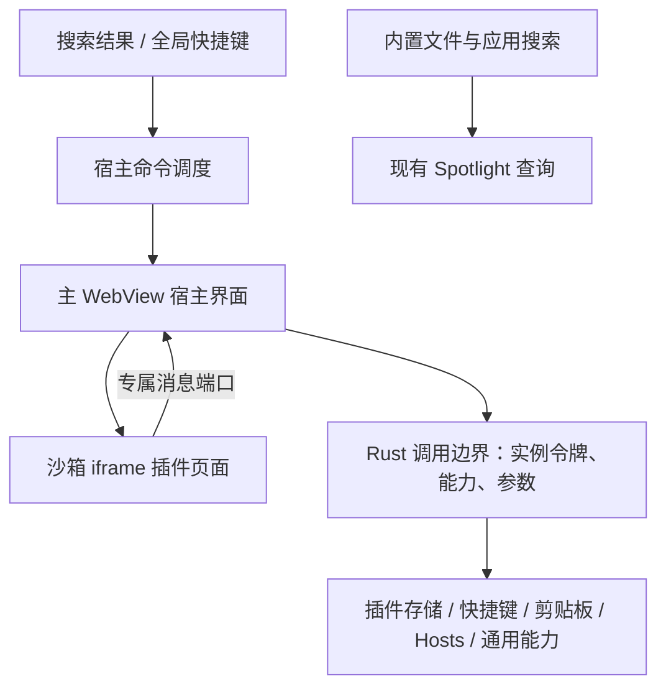

# 插件架构与开发计划

日期：2026-09-21，2026-09-24 修订。方案版本：0.2。状态：0.1 已按子 WebView 方案实现三个插件；0.2 架构调整已确认，迁移尚未实施。

用户已反馈当前搜索“好像没啥问题了”，开始推进插件阶段。本文给出实施建议，不代表尚未展示的插件视觉稿已经确认。

### 0.2 修订摘要

用户确认插件按生态开发：插件可由第三方编写，新增普通插件不修改、不重新编译主应用。0.1 的“原生子 WebView + 非激活面板”在 macOS 上导致插件内 `⌘X/C/V` 失效，需要改写 Wry 内部按键方法才能部分恢复，不适合作为生态的长期基础。0.2 调整为：

| 决策 | 0.1 | 0.2 |
| --- | --- | --- |
| 面板焦点 | 非激活面板，应用始终不激活 | 非激活面板，应用始终不激活；面板用 `NSEvent` 本地监听把 `⌘X/C/V/A` 派发给焦点对象（2026-09-26 由方案 A 改为方案 B，见 10.1） |
| 插件载体 | 每个插件一个原生子 WebView | 主 WebView 内的沙箱 iframe，只能通过消息通道访问宿主 |
| 插件能力 | 为自带插件定制的宿主接口 | 通用能力 + 清单声明权限；现有 `hosts.*`、`clipboard.history` 作为宿主系统服务保留 |
| 接口契约 | 打包进插件的 SDK 直接调用 Tauri | 带版本号的消息协议是契约，SDK 只是协议的封装 |
| 插件后端 | 不提供 | 仍不提供；通过协议版本预留扩展 |

第 2、3、5、6 节已按 0.2 改写；第 10～12 节为 0.2 新增。第 4、7、8、9 节保留 0.1 内容，其中与 0.2 冲突之处以第 10 节为准。

## 1. 第一批交付

先交付插件框架和一个真正可用的 JSON 插件，用它验证搜索入口、插件界面、快捷键、数据保存及剪贴板文本读写。随后实现剪贴板历史，最后实现 Hosts 切换。

| 所属部分 | 负责的能力 |
| --- | --- |
| 宿主内置 | 主入口、目录到达、文件与应用搜索、插件管理、窗口、快捷键注册、SQLite 与系统接口 |
| JSON 插件 | 文本编辑、校验、格式化、压缩、复制结果、编辑偏好 |
| 剪贴板插件 | 历史展示、搜索、选择与恢复；采集、类型读写和附件保存由宿主提供 |
| Hosts 插件 | 方案编辑与选择；系统文件的授权写入、备份、外部修改检测由宿主提供 |

插件包使用 HTML、CSS、JavaScript，项目默认用 React + TypeScript + Vite 编写。普通插件增加和更新无需重新编译轻匣；只有插件需要通用能力目录之外的新系统能力时才更新宿主，新能力按第 11 节通用化设计，不为单个插件定制。

本阶段交付本地插件目录加载、手动重新加载和启停。插件市场、下载更新、插件后端运行时、其他工具的插件兼容属于后续范围。

## 2. 进入与退出

用户路径：`⌥Space → 输入 json → 选择 JSON 工具 → 回车 → 插件面板`。配置全局快捷键后，可以从其他应用直接进入同一命令。

- 插件沿用无标题栏、毛玻璃、可拖动的悬浮面板。进入时沿用主入口所在屏幕和位置，向下展开；具体编辑布局在 JSON 插件阶段提供可运行界面评审。
- 主输入框保留在上方；JSON 插件不重复显示标题栏，编辑器直接占用下方内容区，快捷键入口位于底部状态栏。
- 插件内 `Esc` 先退出弹层或中文选词；没有这些临时状态时返回主入口。主入口的 `Esc` 隐藏窗口。
- 编辑快捷键交给当前获得焦点的页面处理：`⌘A/C/X/V/Z/⇧Z` 不应返回搜索或隐藏插件。面板不激活应用，剪切、复制、粘贴、全选由面板的本地按键监听派发给焦点所在的 iframe；插件自己的 `⌘S`、编辑器撤销等按键以普通键盘事件送达插件页面，宿主不再改写 WebView 的原生按键处理。插件负责自己的编辑历史和保存行为。
- 面板焦点（0.2）：唤起时只置前面板并取得键盘焦点，不激活应用，之前的前台应用始终保持前台，收起面板后键盘焦点自然回到它。保持 `Accessory` 策略，不显示 Dock 图标。面板失去键盘焦点时按失焦规则隐藏。
- 全局主入口快捷键始终返回搜索；插件命令快捷键始终打开对应插件。重复打开当前插件保留本次编辑内容。
- 点击其他应用时隐藏插件，当前插件的编辑状态暂留；切换插件、禁用或重新加载时卸载原视图。JSON 插件在编辑变化时保存草稿，避免依赖退出时的异步保存。

按用户最新要求，保留顶部 60px 输入框，下方固定为 610px 的内容区，原生窗口总高 670px。设置页和所有插件只能使用此区域，内容超出时内部滚动。主入口右侧按钮在下方打开设置，包含快捷键与插件管理。0.2 起插件在主 WebView 内容区中以 iframe 呈现，不创建原生子视图或独立窗口；最多保留一个插件 iframe，切换插件时销毁旧 iframe 并作废其实例令牌。

## 3. 架构和调用路径



插件页面拿不到 Tauri 接口，也不能访问宿主页面；它只能通过宿主交给它的专属消息端口发请求。宿主界面把请求连同实例令牌转交 Rust 网关，由网关判定插件身份、权限和参数。

启动时只读取插件描述文件，构建内存中的命令目录；选中命令后才加载插件脚本。命令搜索只匹配描述文件中的名称、标题和关键词，不要求每个插件执行一遍搜索逻辑。

普通关键词同时查插件命令与现有文件搜索。精确匹配的插件命令先展示，再展示应用、目录和文件；插件命令最多占 5 项，合并总数最多 50。路径输入仍只走目录到达。用户已选中结果时，新到的文件搜索结果不得改变当前选中目标。

## 4. 插件描述协议

插件源码放在项目 `plugins/` 下，构建产物是一份可以独立分发的目录：

```text
json-tools/
├── manifest.json
├── index.html
├── icon.svg
└── assets/
```

建议第一版描述如下；这是轻匣业务插件协议：

```json
{
  "id": "json-tools",
  "name": "JSON 工具",
  "version": "0.1.0",
  "apiVersion": 1,
  "entry": "index.html",
  "icon": "icon.svg",
  "commands": [
    {
      "id": "open",
      "title": "JSON 格式化",
      "keywords": ["json", "格式化", "校验", "压缩"],
      "suggestedShortcut": "Super+Shift+J"
    }
  ],
  "permissions": ["clipboard.writeText"]
}
```

- 插件 ID、命令 ID 使用小写字母、数字和中划线；命令内部标识为 `json-tools:open`。
- `apiVersion` 首版只接受 `1`；不认识的能力、重复命令、缺失入口或非法描述应明确报错，只影响对应插件。
- `entry`、图标和资源必须是包内相对路径。解析后再次校验真实路径，拒绝绝对路径、上级目录穿越以及指向包外的符号链接。
- `icon` 已接入，可选，支持 SVG、PNG、JPEG、WebP，文件不超过 256 KB。搜索结果和插件管理共同使用插件声明的图标；省略或图片无法解码时显示通用插件图标。更换文件后在插件管理点“重新加载插件”。自带 JSON 使用包内 `icon.svg`。
- 建议快捷键只作提示，不自动占用系统快捷键。最终值存于宿主数据库。
- 第一版命令均打开视图；剪贴板采集属于宿主服务，不通过隐藏的插件页面持续运行。
- 插件包和用户数据分开，重新加载或更新插件不会覆盖快捷键与草稿。

运行时插件目录使用 `app_data_dir()/plugins/<插件 ID>/`；具体平台路径由 Tauri 返回。首版支持从本地目录导入副本及手动重新加载，自带 JSON 插件也使用相同描述和加载链路。

## 5. 最小 SDK

SDK 位于 `packages/plugin-sdk/`，只封装已有宿主接口。普通插件不需要了解 Tauri 的调用细节。

0.2 起 SDK 不再直接调用 Tauri，而是封装第 10.3 节的消息协议。SDK 被打包进每个插件，因此协议才是宿主与插件之间的稳定契约：宿主按 `apiVersion` 保持兼容，已发布插件不需要因宿主升级而重新构建。是否处于轻匣内由握手结果判断，不再使用 `isTauri()`；未握手时保留浏览器预览行为。

| 接口 | 第一版行为 |
| --- | --- |
| `view.ready()` | 当前插件加载完成后请求展示下方内容区 |
| `view.back()` / `view.hide()` | 返回搜索或隐藏当前插件面板 |
| `storage.get(key)` / `set(key, value)` | 读写当前插件命名空间内的 JSON 数据 |
| `shortcuts.get()` / `set(shortcut)` | 读写当前插件命令绑定；设为空可解除绑定 |
| `clipboard.writeText(text)` | 显式复制文本，需要对应能力声明 |

插件内快捷键由当前视图处理，例如 JSON 插件的格式化操作；系统全局快捷键只由宿主注册。统一的快捷键录入组件可以放到插件设置页，使用上表接口。

首版返回中文错误消息。0.2 起面向第三方，错误改为“稳定错误码 + 中文消息”，见第 10.3 节。上下文查询、删除存储键及读取剪贴板留待实际使用时添加。

不预先为 JSON 插件开放文件搜索、任意文件读写、数据库查询或命令执行接口。新增能力按第 11 节的通用能力规则逐项增加。

## 6. 加载和调用边界

> 0.2 修订：本节中“按发起 WebView 确定插件身份”的规则由第 10.2 节的实例令牌取代，其余原则（路径校验、网关二次核验、权限不静默扩大、只加载本地资源）继续有效。插件页面由 iframe 承载后，所有资源请求和调用都来自主 WebView，不能再用 WebView 标识区分插件。

使用 Rust 注册的自定义资源协议读取插件包。协议处理函数根据真实发起 WebView 的宿主映射确定插件目录，再解析资源路径；不能仅凭 URL 中的插件 ID 决定可读取的目录。响应包含正确资源类型与 CSP。

宿主保存 `WebView 标识 → 插件 ID、当前命令、实例代次`。SDK 调用的插件身份由 Tauri 注入的发起 WebView 确定，参数中的插件 ID 不能授予访问权；插件重新加载后，旧实例的调用和迟到响应失效。

需要先收紧现有自定义命令：Tauri 默认允许应用各 WebView 调用 `invoke_handler` 注册的应用命令，仅增加一个插件 capability 文件不足以隔离。通过 `AppManifest::commands` 声明应用命令，并明确分配主入口与插件权限；插件只能进入有限的 `plugin_call` 网关，不能直接调用 `open_path`、`save_shortcut` 或创建宿主窗口。[Tauri 官方说明](https://v2.tauri.app/security/capabilities/)

网关再次核验启用状态、实例、方法权限与参数范围。基础视图操作、自己的存储和自己的快捷键属于 SDK 基础能力；剪贴板读写等系统数据能力必须在描述中声明。首版导入自用插件时由宿主管理启用状态与能力集合，后续升级增加能力时显示新增内容，不静默继承更大范围。

插件页面只加载本地包内资源；阻止非插件页面导航、任意弹窗与远程脚本。具体自定义协议的 origin、CSP 和 capability 匹配需先在当前 Tauri 2.11.5 的安装包中验证，不把浏览器预览当成验证结果。

独立 WebView 是界面和调用范围的隔离，不承诺独立操作系统进程，也不承诺能承载任意不可信第三方插件。首版按本地自用插件实施。

0.2 起面向第三方插件：iframe 沙箱负责界面与接口隔离，权限声明与用户确认负责能力边界。iframe 与宿主共用网页进程，不提供进程级隔离；卡死由第 10.5 节的看门狗兜底。

## 7. 生命周期、存储和快捷键

打开顺序：命令调度 → 校验启用与命令存在 → 创建隐藏视图 → 加载完成并握手 → 布局和置前 → 显示主输入框下方内容区。加载失败保持主入口可用，并显示错误；用实例代次避免慢插件覆盖后来打开的插件。

失焦隐藏与禁用不同：隐藏保留当前视图，禁用则解除快捷键、停止该插件对应的宿主服务、销毁视图并撤销调用资格。重新加载也先终止旧实例。命令的搜索入口和全局快捷键入口使用同一调度方法。

仅随实际功能增加三个逻辑存储单元，具体 SQL 在实现时定稿：

| 存储 | 内容 |
| --- | --- |
| 插件状态 | 插件 ID、启用状态、允许的能力集合 |
| 快捷键绑定 | 命令完整 ID、规范化快捷键；与主入口绑定统一做冲突检查 |
| 插件键值数据 | 插件 ID + key 为主键，JSON 值；保存偏好和 JSON 草稿 |

全局快捷键保存沿用现有的失败保留旧绑定原则，操作由宿主串行完成。注册成功后才保存；保存失败撤销新绑定并恢复旧绑定。启动恢复注册失败时保留用户配置、显示冲突状态，用户仍可通过搜索进入插件。

剪贴板历史数据表和图片附件管理跟随剪贴板阶段增加；不会把历史记录塞进通用设置键值表。

## 8. 首个 JSON 插件

交付编辑、格式化、压缩、错误行列提示、复制结果，以及插件内全局快捷键设置。剪贴板内容由用户主动读取，打开插件不自动读取。

格式化必须使用保留原始数字字面量的解析或格式化方案，不使用 `JSON.parse` 后再 `JSON.stringify` 的直接组合。验收包含大于安全整数范围的数字、指数、小数、中文、转义、错误输入、空输入及大文本。重复键按原文保留，不经过对象反序列化而丢失字段。

根据用户提供的编辑器参考图，首版使用 CodeMirror 提供行号、语法高亮、选区与撤销。视觉验收重点是与现有主入口衔接、可读性、键盘操作和返回行为。

## 9. 开发任务与并发顺序

任务状态统一维护在[任务跟踪](任务跟踪.md)的“插件阶段”中。本节只定义边界。

| 编号 | 任务 | 依赖 | 拟定文件范围 | 验收结果 |
| --- | --- | --- | --- | --- |
| PL01 | 协议、描述校验和 SDK 类型 | 本方案 | `src-tauri/src/plugins/manifest.rs`、`packages/plugin-sdk/` | 合法样例可读；重复 ID、越界入口、不支持版本被拒绝 |
| PL02 | 资源加载、独立视图与调用隔离 | PL01 | `src-tauri/src/plugins/runtime.rs`、`assets.rs`、`bridge.rs` | 本地 JSON 壳能打开；越权调用被拒绝；加载失败能回搜索 |
| PL03 | 插件发现、启停、数据存储 | PL01 | `src-tauri/src/plugins/registry.rs`、`storage.rs` | 重启保留状态与数据；禁用后无法调用；坏插件不拖垮主入口 |
| PL04 | 插件快捷键与统一命令调度 | PL01 | `src-tauri/src/shortcuts.rs`、`plugins/commands.rs` | 插件内改键即时生效；冲突保留旧值；禁用后解除 |
| PL05 | 搜索入口、插件管理和视图联调 | PL02、PL03、PL04 | `src/features/plugins/`，集成负责人接入 `App.tsx` | 名称可搜；回车/快捷键同入口；返回、隐藏、重开和 50 项限制通过 |
| PL06 | JSON 插件 | PL02、PL03，PL04 提供快捷键联调 | `plugins/json-tools/` | 实际格式化不损失数值，配置与草稿可恢复，独立更新无需编译宿主 |
| PL07 | 安装版验收与交付 | PL05、PL06 | 测试及任务记录 | 重启、连续切换、禁用、坏插件、快捷键、权限边界及原有搜索回归 |
| PL08 | 剪贴板历史插件 | PL07 | 后续按文本、图片、文件分批拆分 | 隐藏视图仍采集；禁用停止采集；三种类型真实写回验证 |
| PL09 | Hosts 插件 | PL07 | 后续独立拆分授权写入与方案界面 | 写入取消、外部修改、备份恢复、真实解析分别验证 |

并发顺序：PL01 先固定接口；随后 PL02、PL03、PL04 三路可并行。PL06 可在加载与存储完成后，与 PL05 的宿主界面联调并行；PL07 统一验收。

`lib.rs`、`build.rs`、Tauri 权限配置、`native_window.rs`、`App.tsx` 由集成负责人统一修改。尤其 `native_window.rs` 中写死的 `get_webview_panel("main")` 必须改为按当前窗口标识查找；视图切换期间的失焦事件也必须统一处理，避免刚打开插件就被隐藏。

首个开发检查点是“JSON 插件壳可以被发现和搜索，在主输入框下方 610px 区域打开并返回”，随后再补完整编辑能力。这个检查点必须在实际 `.app` 内验证。

## 10. 0.2 架构：非激活面板与沙箱 iframe

### 10.1 面板激活与焦点交还

- 移除 `NonactivatingPanel` 样式，保留浮动面板、所有桌面空间可见、全屏辅助等集合行为和 `Accessory` 策略。
- 唤起：置前面板并激活应用。系统最低版本为 macOS 13，使用 `activateIgnoringOtherApps:`（14 起标记弃用但仍可用）。
- 隐藏：收起面板后隐藏应用，由系统把焦点交还之前的前台应用。打开导入选择器等系统面板期间不得误触发隐藏，沿用现有迟到失焦处理并复核。
- 保留 Tauri 默认菜单（`enable_macos_default_menu` 默认开启，包含“编辑”菜单）。`Accessory` 应用不显示菜单栏，但激活后菜单快捷键应生效，见第 12.2 节待验证项。
- 过渡：2026-09-24 在 `native_window/editing.rs` 中加入的“`⌘X/C/V` 直接发送剪切、复制、粘贴动作”是 0.1 子 WebView 下的临时修复，随 PL19 与整个按键方法替换一起删除。

**PL10 结论（2026-09-24）：采用方案 A。** 用户实测全屏应用上方唤起不切回桌面，Esc 收起后仍停留在全屏应用。

**2026-09-26 改为方案 B。** 方案 A 上线后仍偶发“在全屏应用上方唤起，被切到其他全屏空间”：激活应用由系统异步完成，可能顺带切换到应用上次激活所在的空间，单次实测无法覆盖。现改为唤起、设置、插件均不激活应用；`prepare` 注册 `NSEvent` 本地监听，面板为键盘焦点时截获单独的 `⌘X/C/V/A`，以 `cut:`/`copy:`/`paste:`/`selectAll:` 发给焦点对象，`⌘Z`、`⇧⌘Z`、`⌘S` 等照常以键盘事件送达页面。导入插件的目录选择框仍需激活应用以弹出系统对话框，保持不变。本节上方的方案 A 做法及以下决策前分析保留备查。

**已知风险与决策关口**：任务跟踪 R10 记录过“在全屏应用上方唤起会切回桌面”，当时正是为此改成非激活面板。因此“唤起时激活”必须先在 PL10 实测，按结果二选一：

| 结果 | 方案 | 做法 |
| --- | --- | --- |
| 全屏上方唤起不切换桌面空间，焦点能正常交还 | A：激活面板 | 按本节上述做法实施 |
| 仍会切回桌面，或焦点交还有问题 | B：保持非激活面板 | 保留现有面板行为；用系统公开的 `NSEvent` 本地事件监听，截获单独的 `⌘X/C/V`，把剪切、复制、粘贴动作发给当前焦点对象，其余按键照常分发。不修改 Wry 内部方法 |

两种方案都不影响 iframe 迁移：插件在主 WebView 内，Wry 对主 WebView 按常规处理按键，`⌘S`、`⌘Z` 等键盘事件都能送达插件。

### 10.2 iframe 载体与资源加载

- 容器：主界面内容区放置 `<iframe sandbox="allow-scripts">`。不加 `allow-same-origin`、`allow-popups`、`allow-top-navigation`、`allow-forms`，`allow` 属性为空。
- 地址：`qingbox-plugin://localhost/<实例令牌>/<entry>`。令牌为 128 位随机值，打开插件时由 Rust 生成；关闭、切换、禁用、重新加载时作废。
- 资源授权：发起 WebView 必须是 `main`，令牌必须对应当前活动实例，然后按第 4 节规则解析并校验包内路径。插件必须使用相对资源路径；现有三个插件的 Vite 配置 `base: "./"` 已满足。
- CSP：主页面 CSP 增加 `frame-src qingbox-plugin:`。插件资源响应附带插件 CSP（PL11 实测）：`default-src 'none'; script-src qingbox-plugin://localhost; style-src qingbox-plugin://localhost 'unsafe-inline'; img-src qingbox-plugin://localhost data:; font-src qingbox-plugin://localhost; connect-src 'none'; frame-src 'none'; object-src 'none'; base-uri 'none'; form-action 'none'`。沙箱不透明来源下 `'self'` 不匹配插件资源，不能使用；`'unsafe-inline'` 样式与 `font-src` 由 PL16 确认。
- IPC 暴露面（PL11 发现）：wry 注册的 `window.webkit.messageHandlers.ipc` 对 iframe 可见。Tauri 会把 iframe 发来的请求当作 main 视图的本地请求处理，唯一的屏障是主页面闭包中的调用密钥；沙箱 iframe 读不到该密钥，现状不可利用，但一旦泄露，插件即可调用 main 权限内的全部命令。约束与加固：宿主永远不向 iframe 传递 `__TAURI_INTERNALS__`、调用密钥或任何 invoke 相关对象；PL12 收紧 main 权限，并用 wry 补丁让脚本消息处理器丢弃非主 frame 的消息（用户已确认，2026-09-24）。插件 CSP 的 `connect-src` 挡不住这条路径。
- 跨域头（PL12 发现）：沙箱 iframe 是不透明来源，Vite 产物的 `<script type="module" crossorigin>`、`<link crossorigin>` 按跨域请求加载，插件资源响应必须带 `Access-Control-Allow-Origin: *`，否则模块脚本不执行、样式不生效。资源仍受“main + 实例令牌”授权，该头只放开浏览器侧的跨域读取。插件 CSP 为 `connect-src 'none'`，`fetch`、XHR 都会被拦截，包括读取自身包内文件；资源一律通过 `<script>`、`<link>`、`` 等标签加载（按 CSP 推断，PL20 用探针复核）。
- 沙箱副作用：插件内 `localStorage`、IndexedDB、Cookie、`navigator.clipboard` 不可用，统一改走宿主能力。未握手的浏览器预览模式仍可使用 `localStorage`。
- 外观：插件文档背景透明以透出面板材质；宿主在握手时下发主题信息。

### 10.3 消息协议 v1

1. **握手**：iframe `load` 后，宿主创建 `MessageChannel`，向 iframe 发送 `{ qingbox: "init", protocol: 1, theme, locale }` 并转移一个端口。SDK 只接受来源为 `window.parent` 的首条 `init` 消息，此后只经该端口通信；宿主不处理来自窗口的其他消息。
2. **请求**：`{ id: number, method: string, params?: object }`。
3. **响应**：`{ id, ok: true, result }` 或 `{ id, ok: false, error: { code, message } }`。
4. **宿主事件**：`{ event: string, payload }`，例如 `view.shown`、`theme.changed`。
5. **错误码**：`permission_denied`、`invalid_params`、`unsupported_method`、`not_found`、`cancelled`、`timeout`、`internal`；`message` 为中文，可直接展示给用户。
6. **转发与身份**：宿主界面把 `{ token, method, params }` 经 `plugin_call` 交给 Rust。插件身份只由令牌决定，参数中出现的插件 ID 一律不作为授权依据。
7. **主题与语言**（PL13 约定）：`theme` 取 `"light"` 或 `"dark"`，来自系统外观；`locale` 当前固定为 `"zh-CN"`。`theme.changed` 的载荷为 `{ theme }`，`view.shown` 无载荷。插件应在 `view.shown` 时聚焦自己的编辑区，宿主只能聚焦 iframe 本身。
8. **错误码**（PL15 定稿）：宿主系统服务已细分，例如 Hosts 取消授权为 `cancelled`，版本过期或外部修改为 `invalid_params`，剪贴板记录或文件不存在为 `not_found`；完整对照见《接口约定》“插件消息协议 v1”。`timeout` 为预留码，当前宿主不返回。
9. **版本规则**：清单 `apiVersion` 表示插件依赖的协议主版本。宿主声明支持的主版本范围，不支持时拒绝加载并提示升级宿主。同一主版本内只增不改：可以新增方法、可选参数和返回字段；错误码集合在 v1 内固定，不新增；删除或改变语义必须升主版本。插件调用宿主不认识的方法时得到 `unsupported_method`，可据此做功能探测。

### 10.4 键盘与焦点

- 插件打开后宿主聚焦 iframe。iframe 内的键盘事件不会冒泡到宿主页面，`Esc` 返回等宿主行为继续由插件调用 `view.back()`。
- 系统全局快捷键由 Rust 注册，不受焦点所在页面影响。焦点在插件内时，宿主页面自己的快捷键（如 `⌘,`）不生效，属预期行为。

### 10.5 故障隔离

- 加载超时沿用 8 秒；同一时间只存在一个插件 iframe。
- 插件死循环会同时阻塞宿主页面脚本，因此看门狗放在 Rust：插件打开期间宿主页面每秒上报一次心跳，连续 3 秒缺失时 Rust 重新加载主 WebView，作废该实例，并提示“插件无响应，已关闭”。

## 11. 通用能力与权限

规则：

1. 能力按“做什么”划分，不按“哪个插件在用”划分。
2. 除基础能力外，都必须在清单 `permissions` 中声明。导入时向用户展示；升级新增权限需要用户重新确认，不静默继承。
3. 带范围的能力（域名、文件路径等）把范围写在清单里，宿主只在该范围内执行。清单格式在首个带范围能力落地时定稿。
4. 剪贴板历史采集、Hosts 写入作为宿主系统服务保留。以后出现类似需求，优先抽象成通用能力，不再新增某个插件专用的接口。
5. 暂不提供插件后端运行时。确有需要时，以新能力或协议新主版本引入，不影响已发布插件。

首批能力（迁移现有接口，行为不变）：

| 方法 | 权限 | 说明 |
| --- | --- | --- |
| `view.ready` / `view.back` / `view.hide` / `view.drag` | 基础，无需声明 | 视图控制 |
| `storage.get` / `storage.set` | 基础，无需声明 | 当前插件命名空间内的 JSON 数据 |
| `shortcuts.get` / `shortcuts.set` | 基础，无需声明 | 当前插件命令的全局快捷键 |
| `clipboard.writeText` | `clipboard.writeText` | 写入纯文本 |
| `clipboard.list` / `clipboard.copy` | `clipboard.history` | 宿主系统服务，见《接口约定》 |
| `hosts.get` / `hosts.save` | `hosts.read` / `hosts.write` | 宿主系统服务，见《接口约定》 |

候选能力（有真实插件需要时再实现，不预先开发）：

| 候选能力 | 边界 |
| --- | --- |
| 读取剪贴板文本 | 单独权限，与写入分开 |
| 网络请求 | 仅限清单声明的域名 |
| 用户所选文件读写 | 经系统对话框选择，仅限所选文件 |
| 打开网址或路径 | 交给系统默认应用 |
| 系统通知 | 仅显示插件自身名称与内容 |
| 经用户授权的特权文件写入 | 路径写在清单，每次写入走系统授权；Hosts 以后可迁移到该能力 |

## 12. 迁移任务与待验证项

### 12.1 任务

任务的子步骤、状态和验证记录统一维护在[任务跟踪](任务跟踪.md)的“插件架构 0.2”中，本节只定义边界。

迁移方式：宿主与 SDK 一次性切换到 iframe 和消息协议，不保留新旧两套插件视图并存。三个插件的业务代码只通过 SDK 调用宿主，切换后重新构建即可；JSON 插件作为首个检查点先验收。

| 编号 | 任务 | 依赖 | 文件范围 | 验收结果 |
| --- | --- | --- | --- | --- |
| PL10 | 面板激活实测与决策（关口） | 无 | `native_window.rs`、`lib.rs` | 按 10.1 在方案 A、B 中确定其一并实施；主搜索框、设置页 `⌘X/C/V/A/Z` 可用；全屏上方唤起不切回桌面 |
| PL11 | iframe 技术验证（关口） | 无 | 临时验证分支、`tests/fixtures/` 验证插件 | 12.2 第 1、2、3、6 项有结论；逃逸验证插件保留作回归 |
| PL12 | Rust：实例令牌、资源授权与网关 | PL11 | `plugins/mod.rs`、`management.rs`、`hosts.rs`、`capabilities/`、`tauri.conf.json` | 过期或伪造令牌被拒；网关返回错误码；不再创建子 WebView |
| PL13 | 宿主前端：iframe 容器与消息桥 | PL11；与 PL12 按接口并行 | `src/App.tsx`、`src/lib/bridge.ts`、新增 `src/features/plugins/` 桥接模块 | 握手、请求转发、事件下发、聚焦、关闭销毁均可用 |
| PL14 | SDK 协议化 | PL11；与 PL12、PL13 并行 | `packages/plugin-sdk/` | 协议层单元测试通过；未握手时浏览器预览可用；插件不再依赖 `@tauri-apps/api` |
| PL15 | 协议对外文档 | PL12～PL14 | `docs/接口约定.md` | 第三方仅凭文档可写出最小插件 |
| PL16 | JSON 插件迁移（首个检查点） | PL10、PL12～PL14 | `plugins/json-tools/` | 原有 JSON 验收全部通过；安装版插件内 `⌘X/C/V/A/Z`、粘贴自动格式化通过 |
| PL17 | Hosts、剪贴板插件迁移 | PL16 | `plugins/hosts-switch/`、`plugins/clipboard-history/` | `⌘S` 保存、授权后恢复插件、历史复制、缩略图、插件快捷键回归通过 |
| PL18 | 卡死看门狗 | PL13 | 宿主前端、`lib.rs`、`tests/fixtures/` | 死循环验证插件 3 秒后被关闭，主入口恢复可用 |
| PL19 | 清理旧链路 | PL16、PL17 | 删除子 WebView 创建、`capabilities/plugins.json`、`native_window/editing.rs`；评估去掉 Tauri `unstable` 特性 | 代码中不再有子 WebView 插件与按键方法替换；编译与测试通过 |
| PL20 | 安装版回归与交付 | PL10～PL19 | 测试与任务记录 | 0.1 的 PL07 验收项加上本节全部验收项；记录安装包校验值与备份位置 |

并发顺序：PL10 与 PL11 并行，两个关口都有结论后再改正式代码；PL12、PL13、PL14 按 10.3 的协议并行，PL18 可随 PL13 之后进行；PL16 为首个检查点，之后 PL17、PL15；PL19 在插件全部迁移后进行；最后 PL20。

### 12.2 待验证项

原型阶段必须先确认以下各项：第 4、5 项由 PL10 负责，其余由 PL11 负责。任一项不成立，先回到本方案调整，再继续迁移。

1. 沙箱 iframe 无法取得 `__TAURI_INTERNALS__`，无法直接请求 IPC 协议，无法访问 `window.parent.document`，无法导航顶层页面。
2. WKWebView 中 iframe 能加载 `qingbox-plugin://` 自定义协议，资源请求能取得发起 WebView 标识。
3. 焦点在 iframe 内时，`⌘S`、`⌘Z` 以键盘事件送达插件；`⌘X/C/V` 经“编辑”菜单作用于 iframe 内的编辑器，包括 CodeMirror 的粘贴事件。
4. `Accessory` 应用激活后，“编辑”菜单快捷键在不显示菜单栏的情况下仍然生效。
5. 在全屏应用上方唤起不切换桌面空间；隐藏后焦点回到之前的应用。
6. 插件 CSP 在沙箱不透明来源下的匹配行为；插件页面背景能够透明。

PL11 结论（2026-09-24）：第 1 项成立，但存在上文“IPC 暴露面”所述前提；第 2、6 项成立；第 3 项部分成立：⌘S 以键盘事件送达 iframe，不冒泡到宿主；⌘X/C/V/A/Z 需在 PL10 选定方案的包上人工复测。另发现 iframe 内脚本自动聚焦不稳定（3 次中 2 次失败），PL13 需实测聚焦方案。
