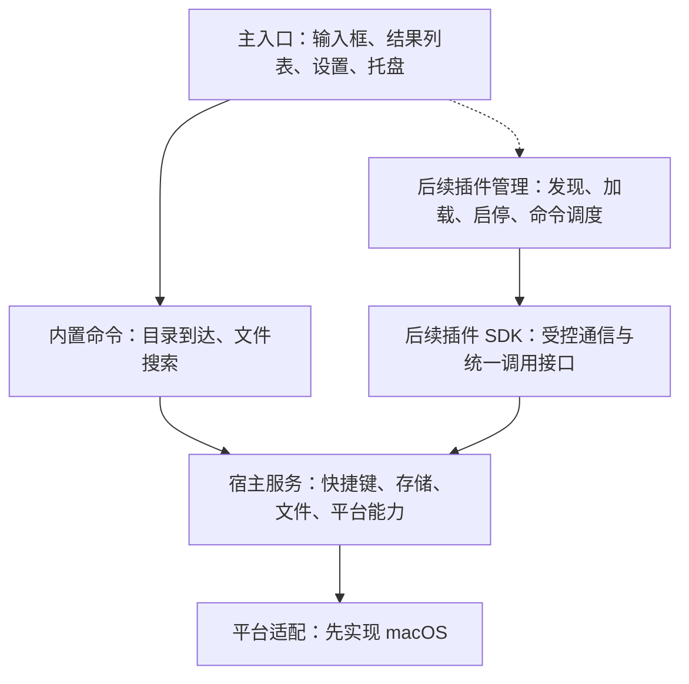

# 轻匣（QingBox）项目立项书

| 项目 | 内容 |
| --- | --- |
| 项目名称 | 轻匣（QingBox），暂定名称 |
| 创建日期 | 2026-09-20 |
| 文档版本 | 0.5 |
| 当前阶段 | 用户反馈当前搜索基本正常，进入插件架构设计；原有专项验收仍见任务跟踪 |
| 平台方向 | macOS 优先，保留跨平台可能 |
| 技术方案 | 已确认：Tauri 2 + React + TypeScript + Rust + SQLite |
| 首期使用方式 | 个人本地使用，插件主要由项目自身开发 |
| 实施原则 | 主输入框与两项内置能力先行，插件框架及业务插件后续推进 |

## 一、背景与目标

现有 uTools 的界面、会员体系和实际使用频率与个人需求不匹配。当前高频使用的是 hosts 切换、JSON 格式化和剪贴板，另希望加入打开目标文件夹、快速文件搜索等能力。

本项目拟开发一个界面统一、操作直接的桌面工具。主入口内置目录到达和文件搜索，剪贴板历史、hosts 切换、JSON 格式化等能力通过插件扩展。全局唤起快捷键可配置，后续支持搜索打开插件和配置插件命令快捷键。

2026-09-20 补充确认：内置搜索同时检索应用，支持系统中文显示名与英文名称，回车启动；明确目录路径自身置顶并同时展示其中的目录和文件。透明度与居中暂缓进一步调整，优先完成功能验证。

首期目标：

1. 完成符合 macOS 风格的全局毛玻璃输入框及可配置唤起快捷键。
2. 完成内置目录到达和快速文件搜索，不依赖插件加载。
3. 将系统能力封装在宿主中，后续扩展插件框架，通过稳定接口调用，新增普通前端插件无需重新编译宿主。
4. 首批功能在本机运行和保存数据，不依赖账号、会员或云服务。
5. 保持实现简单，仅在已有需求需要时增加机制和抽象。

## 二、需求确认与默认假设

### 已确认的需求

- macOS 优先，保留后续跨平台能力。
- 目录到达和文件搜索内置于主入口；剪贴板、hosts、JSON 等其他工具通过插件呈现。
- 主入口采用聚焦搜索式的毛玻璃悬浮输入框，没有传统标题栏和红黄绿按钮；插件界面暂不讨论。
- 输入框初始宽度为屏幕宽度的 1/3，高度 60px，水平居中，垂直位于上方 1/3；具体坐标口径见主入口实施计划。
- 全局唤起快捷键必须可配置，后续插件内也可以配置命令快捷键。
- 功能清单包含打开目标文件夹、快速文件搜索、图片／文本／文件剪贴板历史、hosts 切换、JSON 格式化。
- 主入口及其两项内置能力优先，插件框架和业务插件后续开发。
- 技术方案已确认：Tauri 2 + React + TypeScript + Rust + SQLite。

### 立项阶段采用的默认假设

- “目录到达”先按输入路径或目录名称定位，并在访达中打开理解，同时提供文件打开能力。
- 文件搜索首期面向文件名和路径，不包含文件正文全文检索。
- 插件首期由项目自身开发，通过本地目录加载；不承诺兼容 uTools 或 Raycast 的插件包。
- 暂不指定最低 macOS 版本；M0 根据实际开发设备、系统接口和依赖要求记录并确定。
- 当前项目名和目录名用于启动项目，不代表最终品牌名称。

上述假设可以在实现前调整，不作为用户已经逐项确认的产品要求。

## 三、范围与交付边界

### 第一阶段：主入口与内置能力

实施细节以[主入口实施计划](主入口实施计划.md)为准。

| 能力 | 首期交付内容 |
| --- | --- |
| 应用外壳 | 无标题栏毛玻璃输入框、菜单栏入口、隐藏后保持后台运行 |
| 快捷启动 | 全局快捷键呼出、输入自动聚焦、键盘选择、回车执行、Esc 隐藏 |
| 快捷键配置 | 主入口快捷键录入、冲突检查、即时应用及持久化 |
| 目录到达 | 路径补全、目录定位、在访达中打开 |
| 文件搜索 | 应用、文件和目录搜索，异步结果，启动应用、打开文件与显示所在目录 |
| 数据存储 | SQLite 保存宿主配置和主入口快捷键 |
| 统一界面 | 输入框下方展开的结果列表、空状态与错误提示 |

### 后续阶段：插件框架

2026-09-21 开始插件阶段，具体方案见[插件架构与开发计划](插件架构与开发计划.md)。先实现本地插件发现、加载、启停、命令调度、插件设置、按插件隔离的存储及最小 SDK，以 JSON 插件验证完整流程；插件视觉随可运行界面评审。

### 后续阶段：业务插件

| 插件 | 目标行为 | 主要依赖 |
| --- | --- | --- |
| JSON 工具 | 格式化、校验并定位错误 | 编辑界面、必要时读取和写入剪贴板 |
| 剪贴板历史 | 查询并恢复文本、图片和文件记录 | 后台采集、类型处理、历史存储 |
| hosts 管理 | 管理多套配置并执行切换 | 配置存储、授权写入、备份恢复 |

首期不包含插件市场、账号与云同步、会员体系、AI 功能、移动端、现有工具插件兼容层，也不同时交付 Windows 和 Linux 版本。

## 四、技术选型

已确认采用 Tauri 2 + React + TypeScript + Rust + SQLite。构建工具、具体依赖版本和原生桥接方式在工程初始化及 M0 验证中确定。

| 层次 | 立项选择 | 用途与约束 |
| --- | --- | --- |
| 桌面宿主 | Tauri 2 | 窗口、托盘、前后端通信、应用打包 |
| 宿主与插件界面 | React、TypeScript、Vite | 统一界面和前端插件开发；依赖版本在工程初始化时锁定 |
| 系统服务 | Rust | 命令调度、存储访问、后台任务、平台适配 |
| macOS 集成 | 按需桥接系统原生 API | 聚焦窗口、文件搜索、完整剪贴板类型和授权操作 |
| 结构化存储 | SQLite | 设置、快捷键映射、插件数据及后续历史记录 |
| 附件存储 | 应用数据目录中的文件 | 图片原件与缩略图等，不在数据库内保存大量 Base64 数据 |

Tauri 在 macOS 使用系统 WKWebView，不随应用打包完整 Chromium。选择它的目的是保持桌面工具的基础体积可控，同时使用前端技术实现插件界面；实际内存、CPU 和响应时间需要测量。

M0 在已确认技术栈内验证关键系统行为，验证结果用于确定原生桥接方式、最低系统版本和性能优化方向。

## 五、主体架构



### 宿主职责

- 管理主入口生命周期、快捷键和内置命令，后续接入插件命令。
- 直接提供目录到达和文件搜索，二者不依赖插件框架。
- 识别调用插件，校验参数、权限和资源范围。
- 提供配置存储及系统能力，管理需要持续运行的后台任务。
- 向插件返回结构化结果；用户可见错误使用简体中文。

### 后续插件职责

- 声明名称、版本、入口、命令、设置及需要调用的能力。
- 实现业务界面与业务规则，通过 SDK 调用系统能力。
- 处理视图进入、离开和销毁时的资源清理。

目录到达、文件搜索和全局唤起始终属于宿主内置能力。后续剪贴板等插件使用的后台任务由宿主管理，并按相关插件启用状态运行。插件视图关闭不等于插件被禁用。

进入插件开发阶段后，仅加载当前需要使用的插件界面。后台持续采集由宿主实现，不建立任意第三方后台脚本运行平台。

## 六、插件协议与加载机制

本节为立项草案；2026-09-21 起的实施细节以[插件架构与开发计划](插件架构与开发计划.md)为准。

Tauri 原生插件与本项目业务插件分开处理：前者扩展编译进宿主的原生能力；后者是运行时加载的前端资源包。

业务插件最小目录示意：

```text
json-tools/
├── manifest.json
├── index.html
└── assets/
```

描述文件草案如下，字段属于本项目拟定协议，不是 Tauri 官方配置：

```json
{
  "id": "json-tools",
  "name": "JSON 工具",
  "version": "0.1.0",
  "apiVersion": 1,
  "entry": "index.html",
  "commands": [
    {
      "id": "format",
      "title": "格式化 JSON",
      "keywords": ["json", "格式化"],
      "suggestedShortcut": "CommandOrControl+Shift+J"
    }
  ],
  "permissions": ["clipboard.read", "clipboard.write"]
}
```

### 最小规则

1. 插件 ID 唯一；命令以“插件 ID + 命令 ID”标识，避免不同插件冲突。
2. 启动时读取描述并建立命令列表，进入插件时加载资源和执行代码。
3. 插件入口必须位于自身目录内；描述错误或接口版本不兼容时，仅禁用该插件并说明原因。
4. 插件使用浏览器环境中的 JS，通过 SDK 调用宿主；新增原生能力需要升级宿主并扩展 SDK。
5. 插件包与用户设置分开保存，更新插件不覆盖用户快捷键和业务配置。
6. 禁用插件时停止其命令调度、解除全局快捷键并清理相关后台任务和订阅；保留已有用户数据。
7. 独立插件界面使用独立 WebView，通过受控通信调用宿主，不直接装入拥有全部权限的宿主页面。

权限不能仅靠描述文件声明实现。宿主根据实际消息来源识别插件，再检查授权和参数，不能信任插件自行传入的身份。首期不向插件提供任意 Shell 执行、任意文件写入或直接访问宿主数据库的接口。

### SDK 首批接口方向

| 能力域 | 预期能力 |
| --- | --- |
| 界面 | 关闭插件视图、返回主入口、显示提示 |
| 配置 | 在当前插件命名空间内读取与保存设置 |
| 文件 | 打开文件、打开目录、显示文件所在位置 |
| 搜索 | 异步查询、取消查询、返回受限数量的结果 |
| 剪贴板 | 按类型读写，后续提供历史查询与恢复 |
| hosts | 后续提供受控的配置应用与恢复操作 |

仅在对应业务阶段实现所需接口，不预先建立完整通用 SDK。首期用示例插件验证调用方式和错误返回约定。

## 七、快捷键设计

快捷键绑定到具体命令，避免只绑定到插件。一个插件可以有多个命令，例如“打开 JSON 工具”或“切换到指定 hosts 配置”。

| 类型 | 生效范围 | 负责方 |
| --- | --- | --- |
| 主入口快捷键 | 应用在后台时也可唤起 | 宿主 |
| 插件命令全局快捷键 | 应用在后台时可执行指定命令 | 插件设置页录入，宿主注册 |
| 插件内部快捷键 | 当前插件视图获得焦点时生效 | 插件视图 |

插件可以提供建议快捷键，用户决定是否启用并可以修改。宿主保存最终映射，统一检查应用内部冲突及系统注册结果；注册失败时保留原有有效绑定并提示原因，不静默覆盖其他命令。

通过主入口、搜索结果和全局快捷键触发的同一个命令，必须进入同一条调度路径。

## 八、关键系统能力方案

### 文件搜索

- 当前通过后台线程中的原生 `MDQuery` 使用 Spotlight 元数据索引，应用与非应用分别联合查询文件名和系统显示名，查询前后台打开已授权的常用目录；应用候选独立获取并优先，显示本地化名称和真实图标。
- 文件搜索与目录补全最多显示 50 项，更多匹配通过更精确的关键词或路径筛选；收到足够候选后停止索引查询，不缓存搜索结果。
- 通过会话和递增请求编号取消过期查询，避免晚到旧请求取消新查询或覆盖新结果；原生查询停止并释放后再放行下一次查询。
- Spotlight 未索引的目录、权限受限位置及尚未完成索引的文件，可能无法返回；界面应能说明当前搜索范围。
- 若实际使用证明确实需要额外覆盖，再加入指定目录的自建索引。届时需要处理初次扫描、文件变化及事件丢失后的补扫。
- 首期不在每次按键时遍历整个磁盘，不把全文搜索纳入当前目标。

### 剪贴板历史

- 由宿主后台检查系统剪贴板变化，初期可通过 `NSPasteboard.changeCount` 进行轻量轮询；检测间隔经实测确定。
- 剪贴板的一次复制可能包含多个项目及多种表示形式，记录模型需要保留类型信息和项目边界。
- 文本存入数据库；图片按内容标识存储为文件，数据库记录关联信息；历史记录配置条数或容量上限并执行清理。
- 文件记录保存文件引用，恢复时写回文件剪贴板类型，不把路径字符串作为文件复制的替代品。
- 文件历史默认不备份源文件本体；源文件删除后明确标记不可用，不承诺文件恢复。
- 识别应用自身恢复剪贴板的行为并去重，避免历史循环增长。
- 验证当前系统的剪贴板访问行为，处理拒绝访问；尊重来源提供的敏感或临时内容标记。
- “写回剪贴板”与“自动粘贴到原应用”分开验收，自动粘贴涉及目标应用焦点和相应系统授权。
- 轮询方式不承诺捕获间隔内的每一次快速复制，需要在验证记录中说明边界。

### hosts 切换

- 插件负责方案编辑、预览和选择，宿主负责系统文件操作。
- 写入采用明确授权的有限操作；正式方案评估独立提权辅助程序，仅开放必要的 hosts 操作。
- 不让整个应用长期以管理员身份运行，不开放通用提权命令接口。
- 写入前备份并检查当前内容是否被外部修改，保留非本工具管理的条目；失败时不得留下部分写入内容。
- 配置保存、系统 hosts 写入和目标应用实际解析结果分别验证，不将“保存成功”视为“切换生效”。

### JSON 格式化

- 优先在插件界面本地完成校验和格式化，错误需要能定位。
- 格式化过程应保留原始数值精度，覆盖超过 JS 安全整数范围的情况。
- 通过大文本样例确认界面不会持续阻塞，再决定是否引入 Worker。

## 九、存储原则

- 运行数据使用应用专属数据目录，不写入项目源码目录。
- SQLite 保存宿主设置、快捷键映射和按插件隔离的数据。
- 图片与缩略图保存为独立文件，和历史记录一起清理，避免删除记录后留下孤立附件。
- 插件资源与用户数据分开，禁用插件不自动删除用户数据。
- 数据结构在开始实现时设计迁移机制，不在立项阶段预建未使用的业务表。

## 十、开发阶段与验收标准

| 阶段 | 交付内容 | 验收标准 |
| --- | --- | --- |
| M0：主入口能力验证 | 最小原型和验证记录 | 验证无标题栏毛玻璃、唤起及焦点、全屏与多屏行为；确认文件搜索接入方式；记录系统版本、授权条件及未解决问题 |
| M1：主输入框与快捷键 | Tauri 工程、输入框、快捷键设置、托盘 | 尺寸及定位符合主入口计划；唤起即可输入；隐藏后可再唤起；快捷键可修改、持久化并处理冲突 |
| M2：目录到达 | 内置路径补全、目录定位和打开 | 中文与空格路径可用；同名目录可区分；无效路径及权限错误有提示 |
| M3：文件搜索 | 内置 Spotlight 查询与结果列表 | 文件和目录可搜索及打开；过期结果不覆盖新查询；索引范围说明准确 |
| M4：主入口验收 | 键盘交互、真实桌面验证及打包 | 中文选字不误触发打开；结果展开不移动输入框；多屏定位及重启后快捷键正常；记录性能与资源占用 |
| M5：插件框架 | 描述协议、加载器、SDK、示例插件、插件快捷键 | 本地插件无需重新编译宿主即可加载；配置可保存；禁用后快捷键失效；无效插件不影响主入口 |
| M6：业务插件 | JSON、剪贴板、hosts 插件分批实现 | JSON 大整数不被改写；各剪贴板类型可恢复；hosts 授权取消无破坏，备份恢复和外部修改检测通过验证 |

M1 完成后先评审真实主输入框的视觉和唤起手感。M4 完成即达到当前主入口交付条件，M5 起再推进插件框架与业务插件，剪贴板等原生能力验证随对应阶段进行。

### 性能验证口径

- 记录硬件、macOS 版本、构建模式、插件数量和测试数据量，使用发布构建进行性能验收。
- 主入口热唤起以“触发快捷键到输入框可用”为口径，初始目标为第 95 百分位不超过 200 毫秒；冷启动单独记录。
- 文件搜索在索引完成的指定测试目录中测量，以“发出查询到展示首批结果”为口径，初始目标为第 95 百分位不超过 300 毫秒；索引规模和匹配方式随结果一起记录。
- 记录空闲和活跃状态下整个应用进程树的内存与 CPU，识别窗口反复打开、插件反复切换是否导致持续增长。
- 上述数值是待验证目标，不是已有测试结论；若无法达到，先记录原因并复核实现，再调整目标。

## 十一、实现前需要收敛的事项

1. M0 确定最低 macOS 版本、构建工具版本和必要的原生桥接方式。
2. 按已确认的输入框方向和尺寸生成可运行原型，验证毛玻璃、键盘操作、焦点与多屏行为；插件界面暂不讨论。
3. 文件搜索是否补充自建索引，以真实目录中的结果覆盖和性能为依据。
4. 若后续支持公开第三方插件，需要单独评估分发、信任和运行隔离，不将自用版本直接视为公开插件平台。
5. 对外分发时再明确签名、公证、更新和授权辅助程序方案；当前不承诺应用商店上架。

## 十二、资料依据与验证状态

以下资料在立项讨论中用于核对技术机制，具体 API 与平台限制仍需在工程实现时按锁定版本验证。

- [Tauri WebView 说明](https://v2.tauri.app/reference/webview-versions/)
- [Tauri 原生插件机制](https://v2.tauri.app/develop/plugins/)
- [Tauri 窗口与 WebView 权限](https://v2.tauri.app/security/capabilities/)
- [Tauri 全局快捷键](https://v2.tauri.app/plugin/global-shortcut/)
- [Tauri 剪贴板接口](https://v2.tauri.app/reference/javascript/clipboard-manager/)
- [Apple Spotlight 元数据查询](https://developer.apple.com/documentation/foundation/nsmetadataquery)
- [Apple 剪贴板接口](https://developer.apple.com/documentation/appkit/nspasteboard)
- [Apple 文件系统事件处理](https://developer.apple.com/library/archive/documentation/Darwin/Conceptual/FSEvents_ProgGuide/UsingtheFSEventsFramework/UsingtheFSEventsFramework.html)
- [Apple 辅助程序服务管理](https://developer.apple.com/documentation/servicemanagement/smappservice)

当前已实现主入口、目录到达和文件与应用搜索，正式版安装至 `/Applications/轻匣.app`；用户于 2026-09-21 反馈当前使用基本正常。插件方案与任务已落盘，插件代码尚未实现。旧概念图中的插件界面不作为当前设计依据；全屏、多屏等专项验收与性能、分发边界仍按任务跟踪分别记录。
